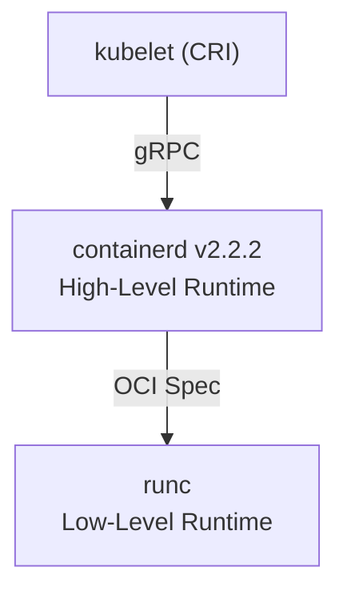
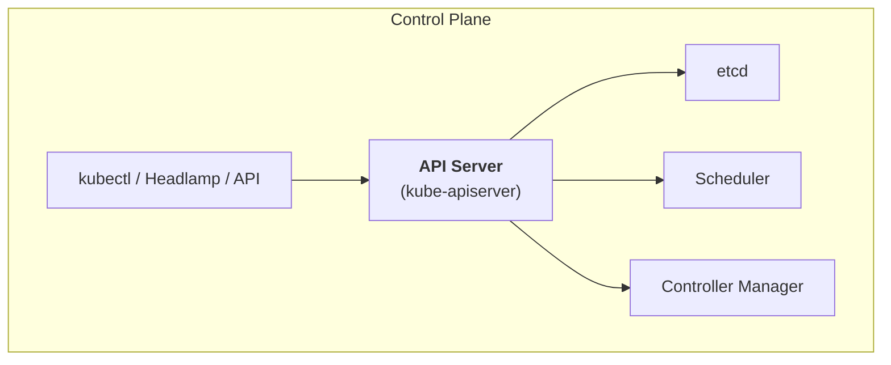
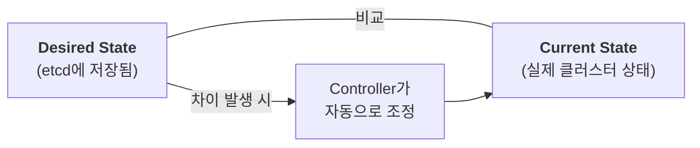

# Chapter 01 — 컨테이너 및 쿠버네티스 개요

## 학습 목표

- 컨테이너와 가상 머신(VM)의 차이를 이해한다
- 컨테이너 런타임 계층 구조를 파악한다
- 쿠버네티스의 아키텍처와 핵심 컴포넌트를 이해한다
- 선언적(Declarative) 모델의 개념을 학습한다
- kubectl 기본 명령어를 익힌다

---

## 1. 컨테이너 vs 가상 머신 (VM)

### 비교 다이어그램

```
  가상 머신 (VM)                        컨테이너
 ┌──────────────────────────┐        ┌──────────────────────────┐
 │ ┌──────┐┌──────┐┌──────┐ │        │ ┌──────┐┌──────┐┌──────┐ │
 │ │App A ││App B ││App C │ │        │ │App A ││App B ││App C │ │
 │ │+Libs ││+Libs ││+Libs │ │        │ │+Libs ││+Libs ││+Libs │ │
 │ ├──────┤├──────┤├──────┤ │        │ └──┬───┘└──┬───┘└──┬───┘ │
 │ │Guest ││Guest ││Guest │ │        │    └───────┼───────┘     │
 │ │ OS   ││ OS   ││ OS   │ │        │ ┌─────────▼───────────┐  │
 │ └──┬───┘└──┬───┘└──┬───┘ │        │ │  Container Runtime  │  │
 │    └───────┼───────┘     │        │ │    (containerd)      │  │
 │ ┌─────────▼───────────┐  │        │ └─────────┬───────────┘  │
 │ │     Hypervisor       │  │        │ ┌─────────▼───────────┐  │
 │ └─────────┬───────────┘  │        │ │  호스트 OS (Linux)   │  │
 │ ┌─────────▼───────────┐  │        │ └─────────┬───────────┘  │
 │ │      호스트 OS       │  │        │ ┌─────────▼───────────┐  │
 │ └─────────┬───────────┘  │        │ │      하드웨어        │  │
 │ ┌─────────▼───────────┐  │        │ └─────────────────────┘  │
 │ │      하드웨어        │  │        └──────────────────────────┘
 │ └─────────────────────┘  │
 └──────────────────────────┘
```

### 핵심 차이점

| 특성 | 가상 머신 (VM) | 컨테이너 |
|------|---------------|---------|
| **격리 수준** | 하드웨어 레벨 (전체 OS) | 프로세스 레벨 (커널 공유) |
| **시작 시간** | 분 단위 | 초 단위 (밀리초 가능) |
| **이미지 크기** | GB 단위 | MB 단위 |
| **리소스 효율** | 낮음 (각각 OS 필요) | 높음 (커널 공유) |
| **이식성** | 제한적 | 매우 높음 (OCI 표준) |
| **밀도** | 호스트당 수십 개 | 호스트당 수백 ~ 수천 개 |

### 컨테이너의 핵심 기술 (Linux)

컨테이너는 Linux 커널의 두 가지 핵심 기능으로 구현됩니다:

- **Namespace**: 프로세스 격리 (PID, Network, Mount, UTS, IPC, User)
- **cgroup (Control Group)**: 리소스 제한 (CPU, 메모리, I/O)

---

## 2. 컨테이너 런타임 계층 구조



**컨테이너 런타임 계층 상세:**

- **kubelet**: CRI (Container Runtime Interface)를 통해 컨테이너 런타임과 gRPC로 통신
- **containerd**: High-Level Container Runtime. 이미지 관리(pull, push, store), 컨테이너 라이프사이클 관리, 스냅샷 관리, 네트워크 인터페이스 설정
- **runc**: Low-Level OCI Runtime. namespace 생성, cgroup 설정, 실제 프로세스 실행

### CRI (Container Runtime Interface)

CRI는 쿠버네티스의 kubelet이 컨테이너 런타임과 통신하기 위한 표준 인터페이스입니다.

- **gRPC 기반**: kubelet과 런타임 간의 통신 규격
- **두 가지 서비스**: RuntimeService (컨테이너 관리) + ImageService (이미지 관리)
- **교체 가능**: containerd, CRI-O 등 CRI를 구현한 런타임이면 교체 가능

> **우리 클러스터**: containerd 2.2.2를 CRI 런타임으로 사용합니다.

### OCI (Open Container Initiative)

- **OCI Image Spec**: 컨테이너 이미지의 표준 포맷
- **OCI Runtime Spec**: 컨테이너 실행 방법의 표준 규격
- **runc**: OCI Runtime Spec의 참조 구현체

---

## 3. 쿠버네티스 아키텍처

쿠버네티스 클러스터는 **Control Plane(컨트롤 플레인)**과 **Worker Node(워커 노드)**로 구성됩니다.

### Control Plane 컴포넌트



| 컴포넌트 | 역할 |
|----------|------|
| **kube-apiserver** | 클러스터의 "정문". 모든 통신이 API Server를 통해 이루어짐. RESTful API 제공, 인증/인가 처리, etcd와 직접 통신하는 유일한 컴포넌트 |
| **etcd** | 분산 키-값 저장소. 클러스터의 모든 상태(desired state)를 저장. 우리 클러스터는 3개의 etcd로 HA 구성 |
| **kube-scheduler** | 새로 생성된 Pod에 적합한 노드를 선택. 리소스 요구사항, affinity/anti-affinity, taint/toleration 등을 고려 |
| **kube-controller-manager** | 다양한 컨트롤러(Deployment, ReplicaSet, Node, Job 등)를 실행. 현재 상태를 원하는 상태로 맞추는 조정(reconciliation) 루프 |

### Worker Node 컴포넌트

| 컴포넌트 | 역할 |
|----------|------|
| **kubelet** | 각 노드에서 실행. API Server로부터 PodSpec을 받아 containerd에 컨테이너 실행을 요청. 노드와 Pod의 상태를 주기적으로 보고 |
| **kube-proxy / Cilium** | Service 네트워킹 담당. 우리 클러스터에서는 kube-proxy 대신 **Cilium**이 eBPF 기반으로 이 역할을 수행 |
| **containerd** | CRI 런타임. 이미지 pull, 컨테이너 생성/삭제 등 실제 컨테이너 관리를 수행 |

### 우리 클러스터 구성

```
Control Plane (3대 HA):  ctrl-0, ctrl-1, ctrl-2
Worker Node   (6대):     wrk-0, wrk-1, wrk-2, wrk-3, wrk-4, wrk-5
API Server VIP:          10.254.0.10
외부 API 접속:            api.basphere.dev:6443
```

---

## 4. 선언적(Declarative) 모델

쿠버네티스의 핵심 철학은 **"원하는 상태(desired state)를 선언하면, 시스템이 자동으로 현재 상태를 맞춘다"** 입니다.

### 명령형(Imperative) vs 선언형(Declarative)

```
# 명령형: "이것을 해라" (how)
kubectl run nginx --image=nginx
kubectl scale deployment nginx --replicas=3

# 선언형: "이런 상태가 되어야 한다" (what)
kubectl apply -f deployment.yaml
# deployment.yaml에 replicas: 3으로 선언
```

### Reconciliation Loop (조정 루프)



예시: Deployment에 `replicas: 3`으로 선언했는데 Pod 1개가 죽으면, Controller가 자동으로 새 Pod를 생성하여 3개를 유지합니다.

---

## 5. kubectl 기본 명령어

kubectl은 쿠버네티스 API Server와 통신하는 CLI 도구입니다.

### 클러스터 정보 확인

```bash
# 클러스터 정보
kubectl cluster-info

# 노드 목록
kubectl get nodes

# 노드 상세 정보
kubectl get nodes -o wide

# 특정 노드 상세 조회
kubectl describe node wrk-0
```

### 리소스 조회

```bash
# 모든 네임스페이스의 Pod 조회
kubectl get pods --all-namespaces
# 또는 줄여서
kubectl get pods -A

# 특정 네임스페이스의 Pod 조회
kubectl get pods -n kube-system

# Pod 상세 출력
kubectl get pods -o wide

# YAML 형식으로 출력
kubectl get pod <pod-name> -o yaml

# 여러 리소스를 한번에 조회
kubectl get pods,services,deployments
```

### 리소스 상세 조회

```bash
# Pod 상세 정보 (이벤트 포함)
kubectl describe pod <pod-name>

# Service 상세 정보
kubectl describe service <service-name>
```

### 유용한 명령어

```bash
# API 리소스 종류 목록
kubectl api-resources

# 특정 리소스의 설명 보기
kubectl explain pod
kubectl explain pod.spec.containers

# 컨텍스트 확인
kubectl config current-context

# 네임스페이스 목록
kubectl get namespaces
```

### 축약어 (Short Names)

| 리소스 | 축약어 |
|--------|--------|
| pods | po |
| services | svc |
| deployments | deploy |
| replicasets | rs |
| namespaces | ns |
| configmaps | cm |
| nodes | no |

```bash
# 예시: 축약어 사용
kubectl get po -A
kubectl get svc -n default
kubectl get deploy
kubectl get ns
```

---

## 데모: 우리 교육 클러스터 상태 확인

```bash
# 노드 확인
kubectl get nodes -o wide

# 예상 출력:
# NAME     STATUS   ROLES           AGE   VERSION   INTERNAL-IP   ...
# ctrl-0   Ready    control-plane   ...   v1.35.3   10.254.0.x    ...
# ctrl-1   Ready    control-plane   ...   v1.35.3   10.254.0.x    ...
# ctrl-2   Ready    control-plane   ...   v1.35.3   10.254.0.x    ...
# wrk-0    Ready    <none>          ...   v1.35.3   10.254.0.x    ...
# wrk-1    Ready    <none>          ...   v1.35.3   10.254.0.x    ...
# wrk-2    Ready    <none>          ...   v1.35.3   10.254.0.x    ...
# wrk-3    Ready    <none>          ...   v1.35.3   10.254.0.x    ...
# wrk-4    Ready    <none>          ...   v1.35.3   10.254.0.x    ...
# wrk-5    Ready    <none>          ...   v1.35.3   10.254.0.x    ...

# 시스템 Pod 확인
kubectl get pods -n kube-system

# Cilium Pod 확인
kubectl get pods -n kube-system -l app.kubernetes.io/name=cilium

# containerd 버전 확인 (노드에서)
kubectl get nodes -o jsonpath='{.items[0].status.nodeInfo.containerRuntimeVersion}'
# 예상 출력: containerd://2.2.2
```

---

## 핵심 요약

1. **컨테이너**는 VM과 달리 커널을 공유하며, namespace와 cgroup으로 격리합니다
2. **containerd**는 CRI를 구현한 고수준 런타임이고, **runc**는 OCI 표준의 저수준 런타임입니다
3. 쿠버네티스는 **Control Plane**(API Server, etcd, Scheduler, Controller Manager)과 **Worker Node**(kubelet, Cilium, containerd)로 구성됩니다
4. **선언적 모델**: 원하는 상태를 정의하면 컨트롤러가 자동으로 현재 상태를 맞춥니다
5. **kubectl**은 쿠버네티스 클러스터와 상호작용하는 핵심 CLI 도구입니다

---

> **다음 챕터**: [Ch.02 핵심 워크로드: Pod, ReplicaSet, Deployment](../ch02-core-workloads/README.md)
