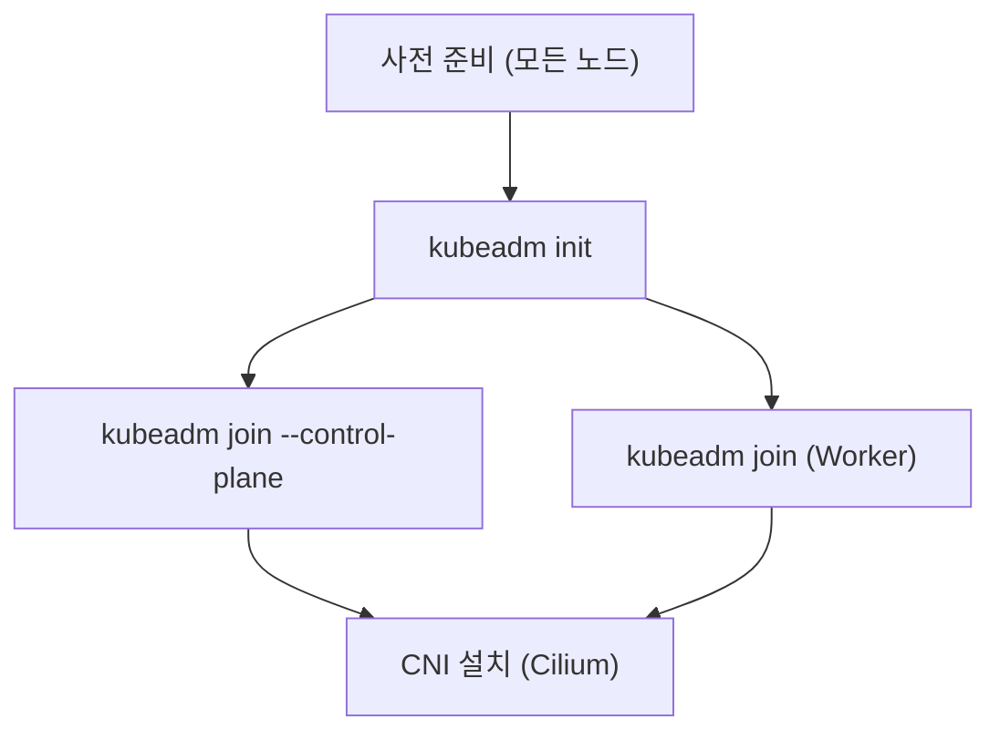

# Chapter 04 — kubeadm 클러스터 구축

> 🎓 **강사 데모** — 이 섹션은 강사가 시연합니다. 수강생들은 Headlamp이나 Grafana에서 결과를 확인할 수 있습니다.

> **참고:** 이 섹션은 강사가 별도 VM 환경에서 데모로 진행합니다. 수강생은 과정을 관찰하며, 실제 교육 클러스터에는 영향을 주지 않습니다.

## 학습 목표

- kubeadm의 역할과 동작 방식을 이해한다
- 노드 사전 준비 단계를 파악한다
- kubeadm init / join 흐름을 이해한다
- HA(고가용성) 클러스터 구성 방법을 개괄적으로 파악한다

---

## 1. kubeadm이란?

kubeadm은 쿠버네티스 클러스터를 부트스트래핑하는 공식 도구입니다.

### kubeadm이 하는 일

- Control Plane 컴포넌트(API Server, etcd, Scheduler, Controller Manager)를 **Static Pod**로 배포
- 인증서(CA, API Server 인증서 등) 자동 생성
- kubeconfig 파일 생성
- 클러스터 부트스트래핑 (RBAC, CoreDNS 등 기본 addon 설치)
- 워커 노드 조인을 위한 토큰 발급

### kubeadm이 하지 않는 일

- OS 설치 및 설정
- 컨테이너 런타임(containerd) 설치
- CNI 플러그인(Cilium) 설치
- 로드밸런서, 스토리지 등 인프라 구성

---

## 2. 노드 사전 준비 (모든 노드 공통)

### 2.1 스왑 비활성화

쿠버네티스는 메모리 관리의 예측 가능성을 위해 스왑을 비활성화해야 합니다.

```bash
# 즉시 스왑 비활성화
sudo swapoff -a

# 영구 비활성화 (/etc/fstab에서 swap 라인 주석 처리)
sudo sed -i '/\sswap\s/s/^/#/' /etc/fstab
```

### 2.2 커널 모듈 로드

```bash
# 필요한 커널 모듈 설정
cat <<EOF | sudo tee /etc/modules-load.d/k8s.conf
overlay
br_netfilter
EOF

# 즉시 로드
sudo modprobe overlay
sudo modprobe br_netfilter
```

### 2.3 커널 파라미터 설정

```bash
# 네트워크 브릿지 및 IP 포워딩 설정
cat <<EOF | sudo tee /etc/sysctl.d/k8s.conf
net.bridge.bridge-nf-call-iptables  = 1
net.bridge.bridge-nf-call-ip6tables = 1
net.ipv4.ip_forward                 = 1
EOF

# 적용
sudo sysctl --system
```

### 2.4 containerd 설치

```bash
# containerd 패키지 설치 (배포판에 따라 다름)
sudo apt-get update
sudo apt-get install -y containerd

# 기본 설정 파일 생성
sudo mkdir -p /etc/containerd
containerd config default | sudo tee /etc/containerd/config.toml

# SystemdCgroup 활성화 (중요!)
# config.toml에서 SystemdCgroup = true로 변경
sudo sed -i 's/SystemdCgroup = false/SystemdCgroup = true/' /etc/containerd/config.toml

# containerd 재시작
sudo systemctl restart containerd
sudo systemctl enable containerd
```

> **중요:** `SystemdCgroup = true` 설정은 kubelet이 사용하는 cgroup 드라이버와 일치시키기 위해 반드시 필요합니다.

### 2.5 쿠버네티스 패키지 설치

```bash
# 쿠버네티스 APT 저장소 추가 (v1.35 기준)
sudo apt-get install -y apt-transport-https ca-certificates curl gpg

curl -fsSL https://pkgs.k8s.io/core:/stable:/v1.35/deb/Release.key | \
  sudo gpg --dearmor -o /etc/apt/keyrings/kubernetes-apt-keyring.gpg

echo 'deb [signed-by=/etc/apt/keyrings/kubernetes-apt-keyring.gpg] https://pkgs.k8s.io/core:/stable:/v1.35/deb/ /' | \
  sudo tee /etc/apt/sources.list.d/kubernetes.list

# kubeadm, kubelet, kubectl 설치
sudo apt-get update
sudo apt-get install -y kubelet kubeadm kubectl

# 버전 고정 (자동 업그레이드 방지)
sudo apt-mark hold kubelet kubeadm kubectl
```

---

## 3. kubeadm init (첫 번째 Control Plane 노드)

### 3.1 초기화 명령

```bash
sudo kubeadm init \
  --control-plane-endpoint "10.254.0.10:6443" \
  --upload-certs \
  --pod-network-cidr "10.244.0.0/16"
```

| 옵션 | 설명 |
|------|------|
| `--control-plane-endpoint` | HA 구성을 위한 API Server VIP (로드밸런서 주소) |
| `--upload-certs` | 추가 Control Plane 노드가 인증서를 자동으로 가져갈 수 있도록 설정 |
| `--pod-network-cidr` | Pod 네트워크 CIDR (CNI에 따라 다름) |

### 3.2 init 후 수행되는 작업

1. 인증서 생성 (`/etc/kubernetes/pki/`)
2. kubeconfig 파일 생성 (`/etc/kubernetes/`)
3. Static Pod 매니페스트 생성 (`/etc/kubernetes/manifests/`)
4. etcd 클러스터 부트스트래핑
5. 기본 addon 설치 (CoreDNS, kube-proxy)
6. 조인 토큰 및 명령어 출력

### 3.3 kubectl 설정

```bash
# 일반 사용자로 kubectl 사용
mkdir -p $HOME/.kube
sudo cp -i /etc/kubernetes/admin.conf $HOME/.kube/config
sudo chown $(id -u):$(id -g) $HOME/.kube/config
```

---

## 4. 추가 Control Plane 노드 조인

HA 구성을 위해 나머지 Control Plane 노드를 조인합니다.

```bash
# kubeadm init 완료 후 출력되는 명령어 사용
sudo kubeadm join 10.254.0.10:6443 \
  --token <token> \
  --discovery-token-ca-cert-hash sha256:<hash> \
  --control-plane \
  --certificate-key <certificate-key>
```

---

## 5. Worker 노드 조인

```bash
# Worker 노드 조인 (--control-plane 옵션 없이)
sudo kubeadm join 10.254.0.10:6443 \
  --token <token> \
  --discovery-token-ca-cert-hash sha256:<hash>
```

---

## 6. CNI 설치 (Cilium)

kubeadm init 후, 노드가 Ready 상태가 되려면 CNI 플러그인을 설치해야 합니다.

```bash
# Cilium CLI 설치 후
cilium install --version 1.19.2

# 또는 Helm으로 설치
helm install cilium cilium/cilium --version 1.19.2 \
  --namespace kube-system \
  --set kubeProxyReplacement=true
```

> CNI가 설치되어야 노드 상태가 `NotReady`에서 `Ready`로 변경됩니다.

---

## 7. kubeadm 전체 흐름 요약



**각 단계 상세:**

- **사전 준비**: 스왑 비활성화, 커널 모듈/파라미터 설정, containerd 설치, kubeadm/kubelet/kubectl 설치
- **kubeadm init**: 인증서 생성, Static Pod 매니페스트 생성, etcd 부트스트래핑, 기본 addon 설치
- **kubeadm join --control-plane**: 추가 Control Plane 노드 조인
- **kubeadm join**: Worker 노드 조인
- **CNI 설치**: Cilium 설치 후 모든 노드가 Ready 상태로 전환

---

## 참고: 우리 교육 클러스터

우리 교육 클러스터는 이미 위 과정이 완료된 상태입니다:

```bash
# 클러스터 상태 확인
kubectl get nodes -o wide

# 예상 출력:
# ctrl-0   Ready   control-plane   v1.35.3
# ctrl-1   Ready   control-plane   v1.35.3
# ctrl-2   Ready   control-plane   v1.35.3
# wrk-0    Ready   <none>          v1.35.3
# wrk-1    Ready   <none>          v1.35.3
# wrk-2    Ready   <none>          v1.35.3
# wrk-3    Ready   <none>          v1.35.3
# wrk-4    Ready   <none>          v1.35.3
# wrk-5    Ready   <none>          v1.35.3
```

---

---

## 8. kubeadm 설정 파일 (Configuration API) 상세

`kubeadm init`은 명령줄 옵션 대신 **YAML 설정 파일**로 클러스터를 구성할 수 있습니다. 설정 파일을 사용하면 재현 가능하고 버전 관리가 가능합니다.

### 사용법

```bash
sudo kubeadm init --config=kubeadm-config.yaml
```

### API 버전과 리소스 종류

kubeadm 설정 파일은 여러 개의 YAML 문서(`---`로 구분)를 포함할 수 있으며, 각 문서는 다른 API 버전과 Kind를 가집니다.

| apiVersion | Kind | 설명 |
|-----------|------|------|
| `kubeadm.k8s.io/v1beta4` | **InitConfiguration** | 부트스트래핑 시 이 노드에만 적용되는 설정 |
| `kubeadm.k8s.io/v1beta4` | **ClusterConfiguration** | 클러스터 전체에 적용되는 설정 |
| `kubeadm.k8s.io/v1beta4` | **JoinConfiguration** | 노드 조인 시 설정 |
| `kubelet.config.k8s.io/v1beta1` | **KubeletConfiguration** | kubelet 데몬 설정 |

### InitConfiguration 상세

```yaml
apiVersion: kubeadm.k8s.io/v1beta4
kind: InitConfiguration
# 이 노드(첫 번째 Control Plane)에만 적용되는 설정
localAPIEndpoint:
  advertiseAddress: "10.254.0.10"   # 이 노드의 API Server 바인딩 IP
  bindPort: 6443                     # API Server 포트 (기본값: 6443)
nodeRegistration:
  name: ctrl-0                       # 노드 이름 (기본값: hostname)
  criSocket: unix:///var/run/containerd/containerd.sock  # 컨테이너 런타임 소켓
  taints:                            # Control Plane 테인트 설정
    - key: node-role.kubernetes.io/control-plane
      effect: NoSchedule
  kubeletExtraArgs:                  # kubelet에 전달할 추가 인수
    - name: "v"
      value: "2"                     # 로그 상세도 (0~10, 높을수록 상세)
```

### ClusterConfiguration 상세

```yaml
apiVersion: kubeadm.k8s.io/v1beta4
kind: ClusterConfiguration
clusterName: training-cluster         # 클러스터 이름
kubernetesVersion: v1.35.3            # 설치할 쿠버네티스 버전
controlPlaneEndpoint: "10.254.0.10:6443"  # HA를 위한 API Server VIP (LB 주소)
networking:
  podSubnet: "10.244.0.0/16"         # Pod CIDR — CNI에서 사용하는 대역
  serviceSubnet: "10.96.0.0/12"      # Service CIDR — ClusterIP 할당 대역
  dnsDomain: "cluster.local"         # 클러스터 DNS 도메인 (기본값)
etcd:
  local:                              # etcd를 Control Plane에 로컬로 실행
    dataDir: /var/lib/etcd            # etcd 데이터 디렉토리
    extraArgs:                        # etcd 추가 인수
      - name: "listen-metrics-urls"
        value: "http://0.0.0.0:2381"  # Prometheus 메트릭 노출
apiServer:
  extraArgs:                          # API Server 추가 인수
    - name: "audit-log-path"
      value: "/var/log/kubernetes/audit.log"  # 감사 로그 경로
    - name: "audit-log-maxage"
      value: "30"                     # 감사 로그 보관 일수
  certSANs:                           # API Server 인증서에 추가할 SAN
    - "10.254.0.10"                   # VIP
    - "k8s-api.example.com"           # 커스텀 도메인
controllerManager:
  extraArgs:                          # Controller Manager 추가 인수
    - name: "bind-address"
      value: "0.0.0.0"               # 메트릭을 모든 인터페이스에서 수집 가능
scheduler:
  extraArgs:                          # Scheduler 추가 인수
    - name: "bind-address"
      value: "0.0.0.0"               # 메트릭을 모든 인터페이스에서 수집 가능
```

### JoinConfiguration 상세

```yaml
apiVersion: kubeadm.k8s.io/v1beta4
kind: JoinConfiguration
# Worker 또는 추가 Control Plane 노드가 클러스터에 조인할 때 사용
discovery:
  bootstrapToken:
    apiServerEndpoint: "10.254.0.10:6443"   # API Server 주소
    token: "abcdef.1234567890abcdef"         # 부트스트랩 토큰
    caCertHashes:                            # CA 인증서 해시 (보안 검증)
      - "sha256:xxxxxxxxxx..."
  # 또는 kubeconfig 파일로 디스커버리:
  # file:
  #   kubeConfigPath: /path/to/discovery-kubeconfig
nodeRegistration:
  name: wrk-0                                # 노드 이름
  criSocket: unix:///var/run/containerd/containerd.sock
controlPlane:                                # 이 섹션이 있으면 Control Plane으로 조인
  localAPIEndpoint:
    advertiseAddress: "10.254.0.11"
  certificateKey: "xxxxxxxxxx..."            # --upload-certs로 생성된 인증서 키
```

### KubeletConfiguration 상세

```yaml
apiVersion: kubelet.config.k8s.io/v1beta1
kind: KubeletConfiguration
# kubelet 데몬의 동작을 세부 설정
cgroupDriver: systemd                 # cgroup 드라이버 (containerd와 일치 필수!)
containerLogMaxSize: "50Mi"           # 컨테이너 로그 파일 최대 크기
containerLogMaxFiles: 5               # 컨테이너 로그 파일 최대 개수
maxPods: 110                          # 노드당 최대 Pod 수 (기본값: 110)
serializeImagePulls: false            # 이미지 병렬 Pull 허용
imageGCHighThresholdPercent: 85       # 디스크 85% 사용 시 미사용 이미지 정리 시작
imageGCLowThresholdPercent: 80        # 디스크 80%까지 정리
evictionHard:                         # 강제 퇴출 임계값
  memory.available: "200Mi"           # 가용 메모리가 200Mi 미만이면 Pod 퇴출
  nodefs.available: "10%"             # 디스크 여유 공간이 10% 미만이면 Pod 퇴출
  imagefs.available: "15%"            # 이미지 디스크 여유 15% 미만이면 Pod 퇴출
```

> **참고**: `cgroupDriver: systemd`는 containerd의 `SystemdCgroup = true` 설정과 반드시 일치해야 합니다. 불일치 시 kubelet이 정상 동작하지 않습니다.

---

## 참고 자료

상세 실습 과정은 다음을 참고하세요: https://github.com/garlicKim21/k8s-6week-course/tree/main/week03-kubeadm

---

## 핵심 요약

1. **kubeadm**은 쿠버네티스 클러스터를 부트스트래핑하는 공식 도구입니다
2. 노드 준비 → `kubeadm init` → `kubeadm join` → CNI 설치 순서로 진행합니다
3. `--control-plane-endpoint`으로 VIP를 지정하면 HA 구성이 가능합니다
4. CNI(Cilium)가 설치되어야 노드가 Ready 상태가 됩니다
5. kubeadm은 클러스터 부트스트래핑만 담당하며, OS/런타임/CNI/스토리지 등은 별도로 구성합니다
6. **설정 파일 API**(v1beta4)를 사용하면 선언적으로 클러스터를 구성할 수 있습니다

---

> **다음 챕터**: [Ch.05 Service와 쿠버네티스 네트워킹](../ch05-service-networking/README.md)
