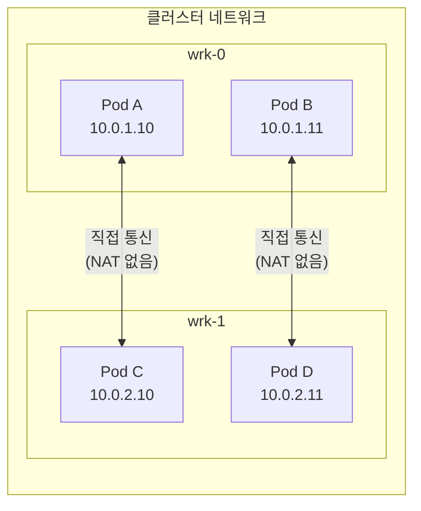
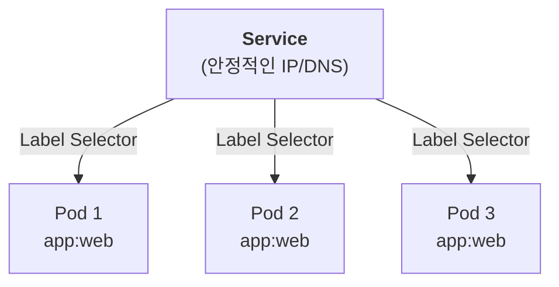
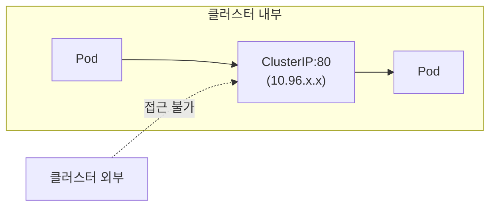
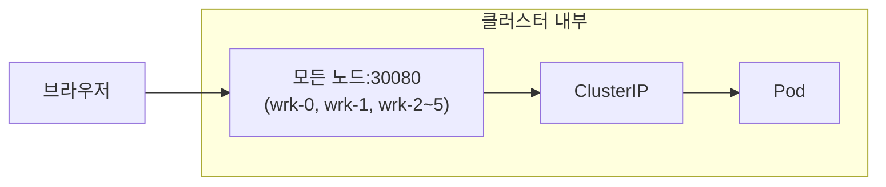
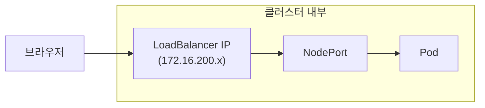

# Chapter 05 — Service와 쿠버네티스 네트워킹

## 학습 목표

- 쿠버네티스 네트워킹 모델을 이해한다
- Service의 개념과 네 가지 유형(ClusterIP, NodePort, LoadBalancer, Headless)을 파악한다
- DNS 기반 서비스 디스커버리를 이해한다
- Endpoints와 EndpointSlice의 역할을 파악한다

---

## 1. 쿠버네티스 네트워킹 모델

### 핵심 원칙

쿠버네티스의 네트워킹은 다음 규칙을 따릅니다:

1. **모든 Pod는 고유한 IP 주소를 갖는다**
2. **모든 Pod는 NAT 없이 다른 모든 Pod와 통신할 수 있다** (Flat Network)
3. **노드의 에이전트(kubelet 등)는 해당 노드의 모든 Pod와 통신할 수 있다**



### 문제: Pod IP는 불안정하다

- Pod는 일시적(ephemeral)이므로, 재생성되면 **IP가 변경**됨
- 여러 Pod 복제본에 대한 **로드밸런싱**이 필요
- Pod IP로 직접 통신하는 것은 비현실적

**해결책: Service**

---

## 2. Service

### Service란?

Service는 **Pod 그룹에 대한 안정적인 네트워크 엔드포인트**를 제공합니다.

- Label Selector로 대상 Pod를 자동으로 선택
- 고정된 Cluster IP (Pod가 재생성되어도 변하지 않음)
- 자동 로드밸런싱
- DNS 이름 제공



---

## 3. Service 유형

### 3.1 ClusterIP (기본값)

클러스터 **내부에서만** 접근 가능한 가상 IP를 부여합니다.



**사용 사례:** 백엔드 서비스, 데이터베이스 등 내부 통신

### 3.2 NodePort

ClusterIP에 추가로, **모든 노드의 특정 포트**를 통해 외부에서 접근 가능합니다.



- 포트 범위: **30000–32767** (기본값)
- 모든 노드에서 동일한 포트로 접근 가능

**사용 사례:** 개발/테스트 환경에서의 간단한 외부 접근

### 3.3 LoadBalancer

NodePort에 추가로, **외부 로드밸런서 IP**를 할당받아 접근합니다.



- 클라우드: 클라우드 제공자의 LB 자동 생성
- **온프레미스: Cilium LB-IPAM + BGP로 구현** (Ch.06에서 자세히 설명)

**사용 사례:** 프로덕션 환경의 외부 서비스 노출

---

> 💻 **수강생 실습** — 이 섹션은 각자의 lab 네임스페이스에서 직접 실습합니다.

## 4. 실습용 예제

### nginx Deployment 배포

```bash
kubectl apply -f examples/deployment-nginx.yaml
```

**examples/deployment-nginx.yaml:**

```yaml
apiVersion: apps/v1
kind: Deployment
metadata:
  name: nginx-svc-demo
  labels:
    app: nginx-svc-demo
spec:
  replicas: 3
  selector:
    matchLabels:
      app: nginx-svc-demo
  template:
    metadata:
      labels:
        app: nginx-svc-demo
    spec:
      containers:
        - name: nginx
          image: nginx:1.27
          ports:
            - containerPort: 80
```

### ClusterIP Service

```bash
kubectl apply -f examples/service-clusterip.yaml
```

**examples/service-clusterip.yaml:**

```yaml
apiVersion: v1
kind: Service
metadata:
  name: nginx-clusterip
spec:
  type: ClusterIP         # 기본값 (생략 가능)
  selector:
    app: nginx-svc-demo   # 이 라벨을 가진 Pod에 트래픽 전달
  ports:
    - protocol: TCP
      port: 80            # Service 포트
      targetPort: 80      # Pod의 컨테이너 포트
```

### NodePort Service

```bash
kubectl apply -f examples/service-nodeport.yaml
```

**examples/service-nodeport.yaml:**

```yaml
apiVersion: v1
kind: Service
metadata:
  name: nginx-nodeport
spec:
  type: NodePort
  selector:
    app: nginx-svc-demo
  ports:
    - protocol: TCP
      port: 80            # Service 포트 (ClusterIP로 접근 시)
      targetPort: 80      # Pod의 컨테이너 포트
      nodePort: 30080     # 노드 포트 (30000-32767)
```

### LoadBalancer Service

```bash
kubectl apply -f examples/service-loadbalancer.yaml
```

**examples/service-loadbalancer.yaml:**

```yaml
apiVersion: v1
kind: Service
metadata:
  name: nginx-loadbalancer
spec:
  type: LoadBalancer
  selector:
    app: nginx-svc-demo
  ports:
    - protocol: TCP
      port: 80
      targetPort: 80
  # 온프레미스: Cilium LB-IPAM이 172.16.200.0/24 대역에서 IP 할당
```

---

## 5. 서비스 디스커버리: DNS

### DNS 기반 서비스 디스커버리

쿠버네티스 클러스터 내에서 Service는 자동으로 DNS 이름이 부여됩니다.

```
<service-name>.<namespace>.svc.cluster.local
```

예시:

```
nginx-clusterip.default.svc.cluster.local    # 전체 FQDN
nginx-clusterip.default                       # 네임스페이스 포함
nginx-clusterip                               # 같은 네임스페이스 내에서
```

### DNS 확인 데모

```bash
# busybox Pod에서 DNS 테스트
kubectl run dns-test --image=busybox:1.37 --rm -it --restart=Never -- \
  nslookup nginx-clusterip

# 예상 출력:
# Server:    10.96.0.10
# Address 1: 10.96.0.10 kube-dns.kube-system.svc.cluster.local
#
# Name:      nginx-clusterip
# Address 1: 10.96.xxx.xxx nginx-clusterip.default.svc.cluster.local
```

---

## 6. Endpoints와 EndpointSlice

### Endpoints

Service를 생성하면, 쿠버네티스는 자동으로 **Endpoints** 리소스를 생성합니다. Endpoints는 Service의 Selector와 일치하는 Pod의 IP:Port 목록입니다.

```bash
# Endpoints 확인
kubectl get endpoints nginx-clusterip

# 예상 출력:
# NAME              ENDPOINTS                                 AGE
# nginx-clusterip   10.0.1.10:80,10.0.1.11:80,10.0.2.10:80   1m
```

### EndpointSlice

EndpointSlice는 Endpoints의 확장 버전으로, 대규모 클러스터에서 더 효율적입니다.

- Endpoints는 하나의 리소스에 모든 엔드포인트를 저장
- EndpointSlice는 여러 조각(slice)으로 나누어 저장 (기본 최대 100개씩)
- 업데이트 시 변경된 slice만 전파하여 성능 향상

```bash
# EndpointSlice 확인
kubectl get endpointslice -l kubernetes.io/service-name=nginx-clusterip

# 상세 정보
kubectl describe endpointslice -l kubernetes.io/service-name=nginx-clusterip
```

---

## 7. Service 동작 확인 데모

### ClusterIP 접근 테스트

```bash
# 1. Deployment 및 Service 배포
kubectl apply -f examples/deployment-nginx.yaml
kubectl apply -f examples/service-clusterip.yaml

# 2. Service IP 확인
kubectl get svc nginx-clusterip

# 예상 출력:
# NAME              TYPE        CLUSTER-IP     EXTERNAL-IP   PORT(S)   AGE
# nginx-clusterip   ClusterIP   10.96.xx.xx    <none>        80/TCP    10s

# 3. busybox Pod에서 Service로 접근 테스트
kubectl run curl-test --image=curlimages/curl --rm -it --restart=Never -- \
  curl -s http://nginx-clusterip

# nginx 기본 페이지가 출력되면 성공

# 4. DNS 이름으로도 접근 확인
kubectl run curl-test2 --image=curlimages/curl --rm -it --restart=Never -- \
  curl -s http://nginx-clusterip.default.svc.cluster.local
```

### NodePort 접근 테스트

```bash
# 1. NodePort Service 배포
kubectl apply -f examples/service-nodeport.yaml

# 2. Service 확인
kubectl get svc nginx-nodeport

# 예상 출력:
# NAME             TYPE       CLUSTER-IP     EXTERNAL-IP   PORT(S)        AGE
# nginx-nodeport   NodePort   10.96.xx.xx    <none>        80:30080/TCP   10s

# 3. 노드 IP 확인
kubectl get nodes -o wide
# INTERNAL-IP 열에서 아무 노드의 IP를 확인합니다 (예: 10.254.0.x)

# 4. 클러스터 내 Pod에서 NodePort로 접근 테스트
kubectl run nodeport-test --image=curlimages/curl --rm -it --restart=Never -- \
  curl -s http://$(kubectl get nodes -o jsonpath='{.items[3].status.addresses[0].address}'):30080

# nginx 기본 페이지가 출력되면 성공
```

> **핵심**: NodePort는 **모든 노드의 동일한 포트(30080)**로 접근할 수 있습니다. 어떤 노드에 요청하든 Service가 알맞은 Pod로 트래픽을 전달합니다.

> 🎓 **강사 데모** — 이 섹션은 강사가 시연합니다. 수강생들은 Headlamp이나 Grafana에서 결과를 확인할 수 있습니다.

### LoadBalancer 접근 테스트

```bash
# 1. LoadBalancer Service 배포
kubectl apply -f examples/service-loadbalancer.yaml

# 2. Service 확인 (External IP 할당 대기)
kubectl get svc nginx-loadbalancer

# 예상 출력 (Cilium LB-IPAM이 IP를 할당):
# NAME                 TYPE           CLUSTER-IP     EXTERNAL-IP    PORT(S)        AGE
# nginx-loadbalancer   LoadBalancer   10.96.xx.xx    172.16.200.x   80:3xxxx/TCP   10s

# 3. External IP로 접근
# curl http://172.16.200.x
```

> **참고:** LoadBalancer 유형의 상세 동작 원리는 다음 챕터(Ch.06 Cilium BGP)에서 다룹니다.

---

## 정리

```bash
kubectl delete -f examples/
```

---

> 🎓 **강사 데모** — 이 섹션은 강사가 시연합니다. 수강생들은 Headlamp이나 Grafana에서 결과를 확인할 수 있습니다.

## 5. Headless Service: Pod별 고유 DNS

### 개념 설명

일반 Service(ClusterIP)는 가상 IP를 통해 로드밸런싱합니다. 요청이 들어오면 kube-proxy나 Cilium이 **임의의 Pod**에 트래픽을 전달하므로, 어떤 Pod가 응답할지 알 수 없습니다.

**Headless Service**(`clusterIP: None`)는 ClusterIP를 할당하지 않고, DNS 조회 시 **Pod IP를 직접 반환**합니다.

StatefulSet과 함께 사용하면 `pod-name.service-name.namespace.svc.cluster.local` 형식으로 **특정 Pod를 지정해서 호출**할 수 있습니다.

**주요 사용 사례:**
- **DB Master-Slave 구성**: Master Pod에만 쓰기 요청을 보내야 할 때
- **분산 시스템**: 각 노드가 서로를 DNS로 찾아 직접 통신해야 할 때 (etcd, Cassandra 등)

### 일반 Service vs Headless Service 비교

| | 일반 Service (ClusterIP) | Headless Service |
|---|---|---|
| ClusterIP | 있음 (10.96.x.x) | 없음 (None) |
| DNS 응답 | ClusterIP 반환 | Pod IP 직접 반환 |
| 로드밸런싱 | kube-proxy/Cilium이 분배 | 없음 (클라이언트가 선택) |
| 특정 Pod 지정 | 불가 | pod-name.svc-name으로 가능 |

### 데모: Headless Service DNS 확인

#### Step 1. StatefulSet + Headless Service 배포

```bash
kubectl apply -f examples/headless-service.yaml
```

**examples/headless-service.yaml:**

```yaml
---
# Headless Service: clusterIP: None으로 Pod IP 직접 반환
apiVersion: v1
kind: Service
metadata:
  name: headless-svc
spec:
  clusterIP: None            # Headless Service의 핵심!
  selector:
    app: web
  ports:
    - protocol: TCP
      port: 80
      targetPort: 80
---
# StatefulSet: serviceName이 Headless Service 이름과 일치해야 함
apiVersion: apps/v1
kind: StatefulSet
metadata:
  name: web
spec:
  serviceName: headless-svc   # Headless Service 이름과 반드시 일치
  replicas: 3
  selector:
    matchLabels:
      app: web
  template:
    metadata:
      labels:
        app: web
    spec:
      containers:
        - name: nginx
          image: nginx:1.27
          ports:
            - containerPort: 80
```

#### Step 2. Pod 준비 확인

```bash
kubectl get pods -l app=web
# web-0, web-1, web-2 모두 Running 상태 확인
```

#### Step 3. Headless Service DNS 조회 — Pod IP 직접 반환

```bash
# Headless Service 이름으로 DNS 조회 (FQDN 사용)
kubectl run dns-test --image=busybox:1.36 --rm -it --restart=Never -- nslookup headless-svc.default.svc.cluster.local
```

**예상 출력:**
```
Name:   headless-svc.default.svc.cluster.local
Address: 10.244.x.x
Name:   headless-svc.default.svc.cluster.local
Address: 10.244.x.x
Name:   headless-svc.default.svc.cluster.local
Address: 10.244.x.x
```

> 3개 Pod IP가 모두 반환됩니다. 일반 Service였다면 ClusterIP 1개만 반환되지만, Headless Service는 **Pod IP를 직접 반환**합니다.
>
> **참고**: 짧은 이름(`nslookup headless-svc`)으로도 최종적으로 해석되지만, busybox nslookup이 search domain을 순서대로 시도하면서 NXDOMAIN 에러가 먼저 출력될 수 있습니다. 혼란을 피하려면 **FQDN(전체 도메인 이름)**을 사용하세요.

#### Step 4. 개별 Pod 지정 호출

```bash
# web-0 Pod만 지정해서 DNS 조회
kubectl run dns-test2 --image=busybox:1.36 --rm -it --restart=Never -- nslookup web-0.headless-svc.default.svc.cluster.local
```

**예상 출력:**
```
Name:   web-0.headless-svc.default.svc.cluster.local
Address: 10.244.x.x    ← web-0의 IP (항상 동일)
```

```bash
# web-2 Pod만 지정해서 DNS 조회
kubectl run dns-test3 --image=busybox:1.36 --rm -it --restart=Never -- nslookup web-2.headless-svc.default.svc.cluster.local
```

**예상 출력:**
```
Name:   web-2.headless-svc.default.svc.cluster.local
Address: 10.244.x.x    ← web-2의 IP (항상 동일, web-0과는 다름)
```

> **핵심**: `pod-name.svc-name.namespace.svc.cluster.local`로 **특정 Pod를 지정**하여 항상 같은 Pod에 도달할 수 있습니다. 이것이 DB Master-Slave 구조에서 Master Pod에만 쓰기 요청을 보낼 수 있는 이유입니다 (Ch10에서 다룸).

#### Step 5. 정리

```bash
kubectl delete -f examples/headless-service.yaml
```

---

## 핵심 요약

1. 쿠버네티스의 모든 Pod는 **고유 IP**를 가지며, NAT 없이 통신합니다
2. **Service**는 Pod 그룹에 대한 안정적인 엔드포인트(IP + DNS)를 제공합니다
3. **ClusterIP**: 내부 전용, **NodePort**: 노드 포트로 외부 접근, **LoadBalancer**: 외부 LB IP 할당
4. **Headless Service**: `clusterIP: None`으로 Pod IP 직접 반환, StatefulSet과 함께 Pod별 고유 DNS 제공
5. **DNS**: `<service>.<namespace>.svc.cluster.local` 형식으로 서비스에 접근 가능
6. **EndpointSlice**가 Service와 Pod를 연결하는 실제 메커니즘입니다

---

> **다음 챕터**: [Ch.06 Cilium CNI와 BGP 기반 LoadBalancer](../ch06-cilium-bgp/README.md)
