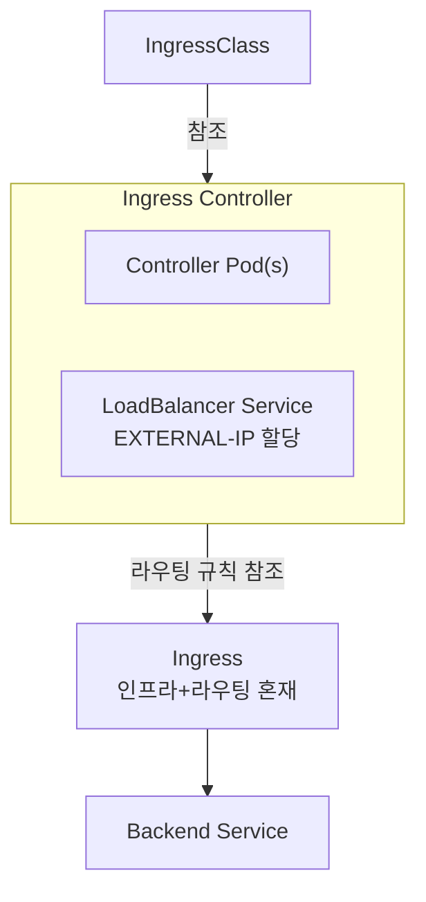
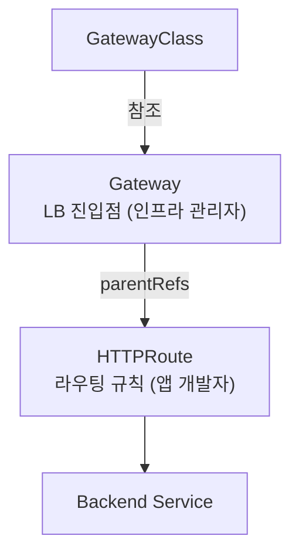
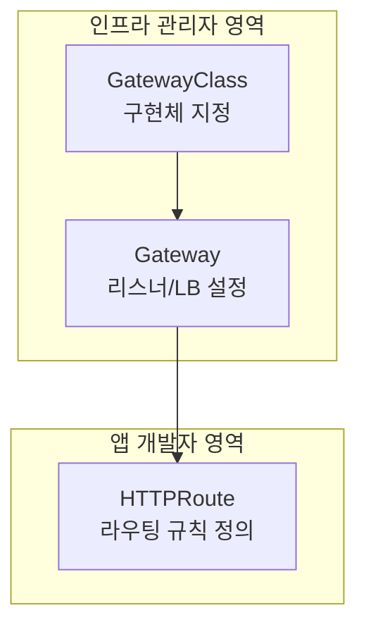
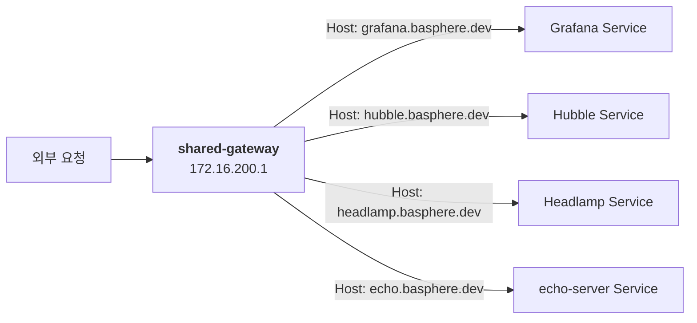
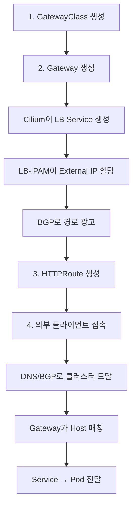
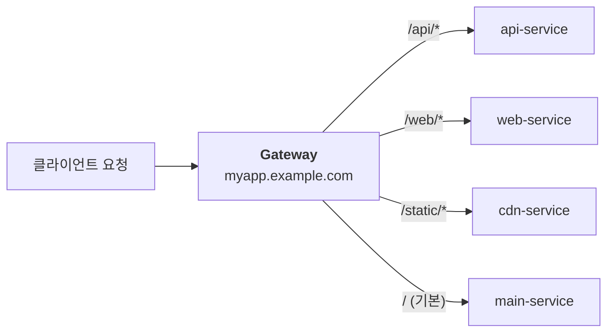
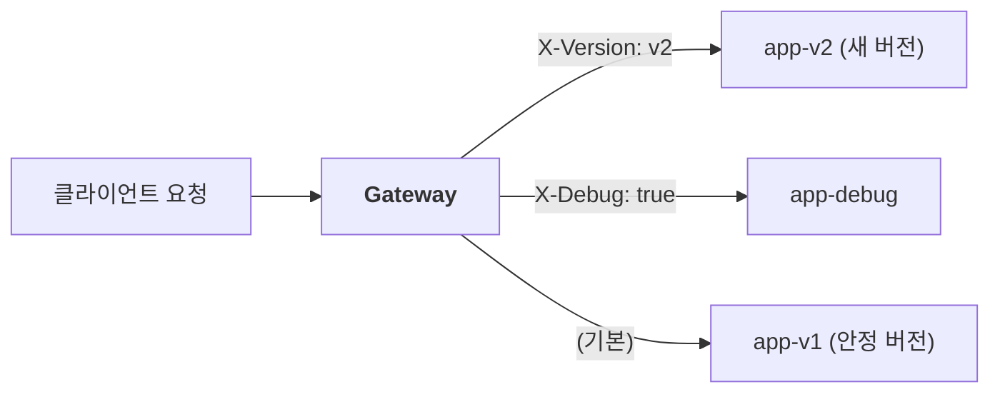
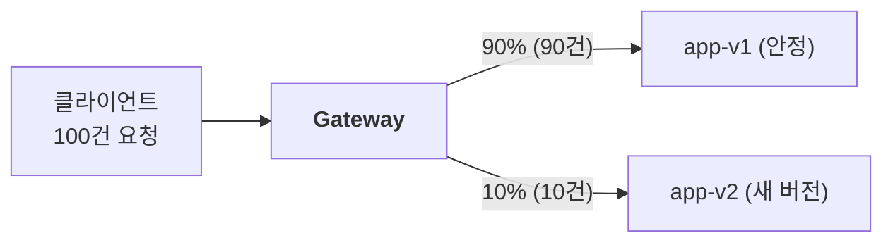

# Chapter 07 — Gateway API를 이용한 HTTP 라우팅

> 🎓 **강사 데모** — 이 섹션은 강사가 시연합니다. 수강생들은 Headlamp이나 Grafana에서 결과를 확인할 수 있습니다.

## 학습 목표

- Gateway API가 등장한 배경과 Ingress와의 차이를 이해한다
- GatewayClass, Gateway, HTTPRoute 세 가지 핵심 리소스의 역할을 파악한다
- 역할 분리(인프라 관리자 vs 앱 개발자) 모델을 이해한다
- HTTPRoute를 작성하여 HTTP 라우팅을 구성할 수 있다

---

## 1. Gateway API란?

Gateway API는 쿠버네티스의 **차세대 인그레스(Ingress) API**입니다.

- 기존 Ingress 리소스의 한계를 해결하기 위해 설계
- Kubernetes **1.29부터 GA** (General Availability) 상태
- SIG-Network에서 관리하는 공식 프로젝트
- 다양한 구현체 지원: Cilium, Istio, Envoy Gateway, nginx 등

### 기존 Ingress의 문제점

| 문제 | 설명 |
|------|------|
| **기능 제한** | HTTP/HTTPS 라우팅만 지원, TCP/UDP/gRPC 등 미지원 |
| **어노테이션 의존** | 구현체별 기능은 비표준 어노테이션으로 설정 (이식성 저하) |
| **역할 분리 불가** | 인프라와 앱 설정이 하나의 리소스에 혼재 |
| **헤더/가중치 라우팅** | 표준으로 지원하지 않음 (어노테이션 필요) |

---

## 2. Ingress vs Gateway API 비교

### 아키텍처 비교 다이어그램

**Ingress 아키텍처:**



**Ingress 구성 요소 설명:**

- **IngressClass**: 어떤 Ingress Controller를 사용할지 정의
- **Ingress Controller Pod(s)**: nginx-ingress-controller, traefik 등. Ingress 리소스를 감시(watch)하고, 자체 설정을 동적으로 갱신하며, 트래픽을 직접 프록시
- **LoadBalancer Service**: 컨트롤러가 직접 생성/관리하는 LB (EXTERNAL-IP: 172.16.200.x)
- **Ingress**: host, path, TLS 설정, 어노테이션(비표준 기능) 등 인프라 설정과 라우팅 규칙이 하나에 혼재

**Gateway API 아키텍처:**



**Gateway API 구성 요소 설명:**

- **GatewayClass**: 어떤 Gateway 구현체(컨트롤러)를 사용할지 정의
- **Gateway**: LB 진입점 자체. 리스너(포트, 프로토콜, TLS) 정의, 컨트롤러가 자동으로 LB Service + Envoy Pod 생성, EXTERNAL-IP: 172.16.200.1, 어떤 네임스페이스의 Route를 허용할지 설정 (인프라 관리자가 관리)
- **HTTPRoute**: 앱 개발자가 관리. hostnames, 경로/헤더/가중치 기반 라우팅 규칙, backendRefs로 대상 Service 지정 (라우팅 규칙만 담당, 인프라 설정과 분리)

### 핵심 차이점

| Ingress | Gateway API | 설명 |
|---------|-------------|------|
| IngressClass | GatewayClass | 구현체(컨트롤러) 지정 |
| Ingress Controller의 LB Service | **Gateway** | 트래픽 진입점 (LB) |
| Ingress 규칙 | **HTTPRoute** | 라우팅 규칙 |

**왜 다른가?**

- **Ingress**: Controller가 LB를 생성하고, Ingress 리소스 안에 인프라 설정(TLS)과 라우팅 규칙이 함께 들어감 → 역할 분리 불가
- **Gateway API**: Gateway가 LB 진입점 자체이고, HTTPRoute는 별도 리소스 → 인프라 관리자는 Gateway만, 앱 개발자는 HTTPRoute만 관리하면 됨

> **비유**: Ingress는 "전화기와 전화번호부가 하나로 합쳐진 것", Gateway API는 "전화기(Gateway)와 전화번호부(HTTPRoute)가 분리된 것"입니다.

### 비교 표

| 항목 | Ingress | Gateway API |
|------|---------|-------------|
| **API 성숙도** | 레거시 (기능 동결) | GA (v1.2+, 활발히 개발 중) |
| **리소스 모델** | Ingress 1개 | GatewayClass, Gateway, HTTPRoute (3단계) |
| **역할 분리** | 불가 | 인프라 관리자 / 앱 개발자 분리 |
| **프로토콜** | HTTP/HTTPS만 | HTTP, gRPC, TCP, UDP, TLS |
| **헤더 기반 라우팅** | 어노테이션 (비표준) | 표준 스펙 |
| **가중치 기반 라우팅** | 어노테이션 (비표준) | 표준 스펙 |
| **트래픽 미러링** | 미지원 (대부분) | 표준 스펙 |
| **크로스 네임스페이스** | 제한적 | ReferenceGrant로 명시적 허용 |

---

## 3. Gateway API 핵심 리소스

### 3단계 리소스 모델



**3단계 리소스 상세:**

- **GatewayClass**: 어떤 구현체를 사용할지 정의 (예: Cilium, Istio, Envoy Gateway 등)
- **Gateway**: 리스너(포트, 프로토콜, 호스트) 정의, 실제 로드밸런서 인스턴스에 대응, 어떤 네임스페이스의 Route를 허용할지 설정
- **HTTPRoute**: 호스트/경로(path)/헤더 기반 라우팅, 백엔드 Service 연결

### 역할 분리

| 역할 | 담당 리소스 | 설명 |
|------|-----------|------|
| **인프라 관리자** | GatewayClass, Gateway | 네트워크 인프라 설정 (포트, TLS, IP 등) |
| **앱 개발자** | HTTPRoute, GRPCRoute 등 | 앱별 라우팅 규칙 설정 (호스트, 경로 등) |

→ 앱 개발자는 Gateway를 직접 만들 필요 없이, 기존 Gateway에 HTTPRoute만 붙이면 됩니다.

---

## 4. 리소스 상세 설명

### 4.1 GatewayClass

어떤 Gateway 구현체를 사용할지 정의합니다. 클러스터 수준의 리소스입니다.

```yaml
apiVersion: gateway.networking.k8s.io/v1
kind: GatewayClass
metadata:
  name: cilium
spec:
  controllerName: io.cilium/gateway-controller
```

- `controllerName`: Gateway를 실제로 구현하는 컨트롤러
- 우리 클러스터에서는 **Cilium**이 Gateway Controller 역할을 합니다

### 4.2 Gateway

실제 리스너(listener)를 정의합니다. 로드밸런서 인스턴스에 대응됩니다.

```yaml
apiVersion: gateway.networking.k8s.io/v1
kind: Gateway
metadata:
  name: shared-gateway
  namespace: gateway-system
spec:
  gatewayClassName: cilium
  listeners:
    - name: http
      protocol: HTTP
      port: 80
      allowedRoutes:
        namespaces:
          from: All          # 모든 네임스페이스의 Route를 허용
    - name: https
      protocol: HTTPS
      port: 443
      tls:
        mode: Terminate
        certificateRefs:
          - name: wildcard-tls
      allowedRoutes:
        namespaces:
          from: All
```

- **listeners**: 수신할 포트와 프로토콜 정의
- **allowedRoutes**: 어떤 네임스페이스의 Route를 수용할지 결정
- Gateway가 생성되면 Cilium이 자동으로 **LoadBalancer Service**를 생성하여 외부 IP를 할당합니다

### 4.2.1 Gateway에서의 TLS 처리

기존 Ingress에서는 개발자가 Ingress 리소스에 직접 TLS 인증서를 지정했지만, Gateway API에서는 **인프라 관리자가 Gateway 리스너에서 TLS를 설정**합니다. 개발자는 HTTPRoute만 작성하면 되므로 인증서에 대해 알 필요가 없습니다.

| 항목 | Ingress | Gateway API |
|------|---------|-------------|
| **TLS 설정 위치** | Ingress 리소스의 `tls:` 필드 | Gateway 리소스의 `listeners[].tls:` |
| **인증서 참조** | `secretName: my-tls` | `certificateRefs: [{name: my-tls-secret}]` |
| **TLS 모드** | 종료(Terminate)만 | `Terminate` 또는 `Passthrough` 선택 가능 |
| **역할 분리** | 개발자가 인증서 Secret에 직접 접근 필요 | 인프라 팀만 인증서 관리, 개발자는 Route만 작성 |

**TLS 모드 설명:**

- **Terminate**: Gateway에서 TLS를 종료하고, 백엔드 Pod에는 평문(HTTP)으로 전달. 가장 일반적인 방식.
- **Passthrough**: Gateway가 TLS를 해독하지 않고, 암호화된 트래픽을 그대로 백엔드로 전달. 백엔드 Pod가 직접 TLS를 처리해야 할 때 사용 (예: 데이터베이스 연결, end-to-end 암호화 요구 시).

**실무에서의 일반적인 구성:**

프로덕션 환경에서는 보통 [cert-manager](https://cert-manager.io/)를 함께 사용하여 Let's Encrypt 인증서를 자동으로 발급하고 갱신합니다:

```yaml
# 1. cert-manager가 자동 생성하는 TLS Secret
apiVersion: cert-manager.io/v1
kind: Certificate
metadata:
  name: wildcard-tls
  namespace: gateway-system
spec:
  secretName: wildcard-tls-secret     # 이 Secret이 자동 생성됨
  issuerRef:
    name: letsencrypt-prod
    kind: ClusterIssuer
  dnsNames:
    - "*.basphere.dev"                # 와일드카드 인증서

# 2. Gateway에서 이 Secret을 참조
apiVersion: gateway.networking.k8s.io/v1
kind: Gateway
metadata:
  name: shared-gateway
  namespace: gateway-system
spec:
  gatewayClassName: cilium
  listeners:
    - name: https
      protocol: HTTPS
      port: 443
      tls:
        mode: Terminate
        certificateRefs:
          - name: wildcard-tls-secret   # cert-manager가 생성한 Secret
      allowedRoutes:
        namespaces:
          from: All

# 3. 개발자는 HTTPRoute만 작성하면 끝 (TLS를 몰라도 됨)
apiVersion: gateway.networking.k8s.io/v1
kind: HTTPRoute
metadata:
  name: my-app
spec:
  parentRefs:
    - name: shared-gateway
      namespace: gateway-system
  hostnames:
    - "myapp.basphere.dev"          # HTTPS가 자동으로 적용됨
  rules:
    - backendRefs:
        - name: my-app-svc
          port: 80
```

> **우리 교육 환경**: 현재 TLS는 OPNsense Nginx에서 종료하고, Gateway는 HTTP(80)만 수신합니다.
> 프로덕션에서는 위와 같이 cert-manager + Gateway TLS를 사용하는 것이 일반적입니다.

### 4.3 HTTPRoute

앱 개발자가 HTTP 라우팅 규칙을 정의합니다.

```yaml
apiVersion: gateway.networking.k8s.io/v1
kind: HTTPRoute
metadata:
  name: my-app-route
  namespace: default
spec:
  parentRefs:
    - name: shared-gateway
      namespace: gateway-system    # 연결할 Gateway
  hostnames:
    - "myapp.basphere.dev"         # 호스트 기반 라우팅
  rules:
    - matches:
        - path:
            type: PathPrefix
            value: /                # 경로 매칭
      backendRefs:
        - name: my-app-service     # 트래픽을 보낼 Service
          port: 80
```

---

## 5. 우리 클러스터의 현재 설정

### Gateway 확인

```bash
# GatewayClass 확인
kubectl get gatewayclass

# 예상 출력:
# NAME     CONTROLLER                    ACCEPTED   AGE
# cilium   io.cilium/gateway-controller  True       ...
```

```bash
# Gateway 확인
kubectl get gateway -n gateway-system

# 예상 출력:
# NAME             CLASS    ADDRESS        PROGRAMMED   AGE
# shared-gateway   cilium   172.16.200.1   True         ...
```

```bash
# Gateway 상세 정보
kubectl describe gateway shared-gateway -n gateway-system
```

> **핵심:** `shared-gateway`의 ADDRESS가 `172.16.200.1`입니다. 이것은 Cilium LB-IPAM에서 할당된 IP이며, BGP를 통해 외부에서 접근 가능합니다.

### 현재 HTTPRoute 확인

```bash
# 모든 네임스페이스의 HTTPRoute 확인
kubectl get httproute -A

# 예상 출력:
# NAMESPACE     NAME        HOSTNAMES                   AGE
# headlamp      headlamp    ["headlamp.basphere.dev"]   ...
# kube-system   hubble-ui   ["hubble.basphere.dev"]     ...
# monitoring    grafana     ["grafana.basphere.dev"]    ...
```

> 현재 Grafana, Hubble UI, Headlamp이 모두 `shared-gateway`를 통해 외부에 노출되어 있습니다.

### 특정 HTTPRoute 상세 확인

```bash
# Grafana의 HTTPRoute 확인
kubectl get httproute -n monitoring grafana -o yaml
```

---

## 6. 실습 데모: echo-server 배포 및 HTTPRoute 연결

### Step 1: echo-server Deployment 및 Service 생성

```bash
kubectl apply -f examples/echo-server.yaml
```

**examples/echo-server.yaml:**

```yaml
apiVersion: apps/v1
kind: Deployment
metadata:
  name: echo-server
  namespace: default
  labels:
    app: echo-server
spec:
  replicas: 2
  selector:
    matchLabels:
      app: echo-server
  template:
    metadata:
      labels:
        app: echo-server
    spec:
      containers:
        - name: echo
          image: ealen/echo-server:0.9.2
          ports:
            - containerPort: 80
          env:
            - name: PORT
              value: "80"
---
apiVersion: v1
kind: Service
metadata:
  name: echo-server
  namespace: default
spec:
  selector:
    app: echo-server
  ports:
    - protocol: TCP
      port: 80
      targetPort: 80
```

echo-server는 요청 정보(헤더, 경로, 메서드 등)를 그대로 응답하는 테스트용 서버입니다.

### Step 2: Deployment 및 Service 확인

```bash
# Pod 상태 확인
kubectl get pods -l app=echo-server

# 예상 출력:
# NAME                           READY   STATUS    RESTARTS   AGE
# echo-server-xxxxxxxxxx-xxxxx   1/1     Running   0          10s
# echo-server-xxxxxxxxxx-yyyyy   1/1     Running   0          10s

# Service 확인
kubectl get svc echo-server

# 예상 출력:
# NAME          TYPE        CLUSTER-IP     EXTERNAL-IP   PORT(S)   AGE
# echo-server   ClusterIP   10.96.xx.xx    <none>        80/TCP    10s
```

### Step 3: HTTPRoute 생성

```bash
kubectl apply -f examples/httproute-echo.yaml
```

**examples/httproute-echo.yaml:**

```yaml
apiVersion: gateway.networking.k8s.io/v1
kind: HTTPRoute
metadata:
  name: echo-route
  namespace: default
spec:
  parentRefs:
    - name: shared-gateway
      namespace: gateway-system
  hostnames:
    - "echo.basphere.dev"
  rules:
    - matches:
        - path:
            type: PathPrefix
            value: /
      backendRefs:
        - name: echo-server
          port: 80
```

### Step 4: HTTPRoute 상태 확인

```bash
# HTTPRoute 확인
kubectl get httproute echo-route

# 예상 출력:
# NAME         HOSTNAMES              PARENTREFS           AGE
# echo-route   ["echo.basphere.dev"]  ["shared-gateway"]   10s

# HTTPRoute 상세 확인 — Accepted/ResolvedRefs 조건 확인
kubectl describe httproute echo-route

# 상태 확인 포인트:
# Conditions:
#   Type: Accepted    Status: True    ← Gateway가 이 Route를 수락함
#   Type: ResolvedRefs Status: True   ← 백엔드 Service를 찾음
```

### Step 5: curl로 테스트

```bash
# echo.basphere.dev로 요청 (DNS가 설정된 경우)
curl -s http://echo.basphere.dev | jq .

# 또는 Gateway IP로 직접 요청 (Host 헤더 지정)
curl -s -H "Host: echo.basphere.dev" http://172.16.200.1 | jq .

# 예상 출력 (echo-server가 요청 정보를 반환):
# {
#   "host": {
#     "hostname": "echo.basphere.dev",
#     ...
#   },
#   "http": {
#     "method": "GET",
#     "baseUrl": "",
#     "originalUrl": "/",
#     ...
#   },
#   ...
# }
```

### Step 6: 경로 기반 라우팅 테스트

```bash
# 다양한 경로로 요청하여 라우팅 확인
curl -s http://echo.basphere.dev/api/test | jq .http.originalUrl
# 예상 출력: "/api/test"

curl -s http://echo.basphere.dev/health | jq .http.originalUrl
# 예상 출력: "/health"
```

---

## 7. 호스트 기반 라우팅 이해

현재 우리 클러스터에서는 **하나의 Gateway(shared-gateway)** 에 여러 HTTPRoute가 연결되어 있습니다. Gateway는 요청의 **Host 헤더**를 보고 어떤 HTTPRoute로 보낼지 결정합니다.



### 확인 방법

```bash
# 모든 HTTPRoute 목록 — 각각 다른 호스트에 매핑
kubectl get httproute -A

# 같은 Gateway IP로 다른 Host 헤더를 보내면 다른 서비스로 라우팅됨
curl -s -H "Host: echo.basphere.dev" http://172.16.200.1 | head -5
curl -s -H "Host: grafana.basphere.dev" http://172.16.200.1 | head -5
```

---

## 8. Gateway API 동작 흐름 전체 요약



**각 단계 상세:**

1. **GatewayClass 생성**: 인프라 관리자가 Cilium 컨트롤러를 지정
2. **Gateway 생성**: 리스너, TLS 등 인프라 설정 → Cilium이 자동으로 LoadBalancer Service를 생성하고 LB-IPAM이 External IP(172.16.200.1)를 할당, BGP로 외부 라우터에 경로를 광고
3. **HTTPRoute 생성**: 앱 개발자가 parentRefs로 Gateway 연결, hostnames로 호스트 매칭, backendRefs로 대상 Service 지정
4. **외부 접속 흐름**: echo.basphere.dev → DNS → 172.16.200.1 → BGP 경로로 클러스터 도달 → Gateway가 Host 헤더 확인 후 echo-route 매칭 → echo-server Service → Pod

---

## 9. HTTPRoute 고급 기능 상세

### 9.1 경로(Path) 기반 라우팅

URL 경로에 따라 서로 다른 백엔드 서비스로 트래픽을 보내는 방식입니다.

**사용 사례**: 마이크로서비스 아키텍처에서 하나의 도메인으로 여러 서비스를 제공할 때



```yaml
apiVersion: gateway.networking.k8s.io/v1
kind: HTTPRoute
metadata:
  name: path-routing
spec:
  parentRefs:
    - name: shared-gateway
      namespace: gateway-system
  hostnames:
    - "myapp.example.com"
  rules:
    # /api로 시작하는 요청 → api-service
    - matches:
        - path:
            type: PathPrefix
            value: /api
      backendRefs:
        - name: api-service
          port: 80
    # /web으로 시작하는 요청 → web-service
    - matches:
        - path:
            type: PathPrefix
            value: /web
      backendRefs:
        - name: web-service
          port: 80
    # 나머지 모든 요청 → main-service (기본 규칙)
    - matches:
        - path:
            type: PathPrefix
            value: /
      backendRefs:
        - name: main-service
          port: 80
```

> **PathPrefix** vs **Exact**: `PathPrefix`는 접두사 매칭(`/api`는 `/api/users`, `/api/orders` 모두 매칭), `Exact`는 정확히 일치하는 경로만 매칭합니다. 규칙은 더 구체적인 경로가 먼저 매칭됩니다.

### 9.2 헤더(Header) 기반 라우팅

HTTP 요청 헤더의 값에 따라 라우팅을 분기하는 방식입니다.

**사용 사례**:
- **A/B 테스트**: 특정 헤더를 가진 사용자에게 새 버전을 보여줌
- **Canary 배포**: QA 팀만 새 버전에 접근하도록 설정
- **내부/외부 트래픽 분리**: 내부 요청은 디버그 모드 서비스로 라우팅



```yaml
apiVersion: gateway.networking.k8s.io/v1
kind: HTTPRoute
metadata:
  name: header-routing
spec:
  parentRefs:
    - name: shared-gateway
      namespace: gateway-system
  hostnames:
    - "myapp.example.com"
  rules:
    # X-Version 헤더가 "v2"인 요청 → 새 버전 서비스
    - matches:
        - headers:
            - name: X-Version
              value: v2
      backendRefs:
        - name: app-v2
          port: 80
    # 기본 규칙 → 안정 버전 서비스
    - backendRefs:
        - name: app-v1
          port: 80
```

테스트 방법:

```bash
# v1 (기본) 접근
curl http://myapp.example.com/

# v2 접근 (헤더 추가)
curl -H "X-Version: v2" http://myapp.example.com/
```

> **실무 팁**: QA 팀에게 브라우저 확장 프로그램(예: ModHeader)으로 `X-Version: v2` 헤더를 설정하게 하면, 일반 사용자에게 영향 없이 새 버전을 테스트할 수 있습니다.

### 9.3 가중치(Weight) 기반 라우팅 (트래픽 분할)

동일한 요청을 여러 백엔드 서비스에 **비율**로 분배하는 방식입니다.

**사용 사례**:
- **Canary 배포**: 새 버전에 10%만 트래픽을 보내 안정성을 확인한 후 점진적으로 증가
- **Blue-Green 배포**: 50:50으로 시작하여 한쪽으로 전환
- **점진적 마이그레이션**: 구버전에서 신버전으로 서서히 트래픽 이동



Canary 배포 단계:
- Phase 1: v1=90%, v2=10% → 에러 없으면
- Phase 2: v1=70%, v2=30% → 에러 없으면
- Phase 3: v1=50%, v2=50% → 에러 없으면
- Phase 4: v1=0%, v2=100% → 완료!

```yaml
apiVersion: gateway.networking.k8s.io/v1
kind: HTTPRoute
metadata:
  name: canary-routing
spec:
  parentRefs:
    - name: shared-gateway
      namespace: gateway-system
  hostnames:
    - "myapp.example.com"
  rules:
    - backendRefs:
        - name: app-v1
          port: 80
          weight: 90      # 전체 트래픽의 90%
        - name: app-v2
          port: 80
          weight: 10      # 전체 트래픽의 10%
```

> **weight 값**: 절대값이 아닌 비율입니다. `weight: 9`와 `weight: 1`은 `90:10`과 동일합니다. weight의 합이 100일 필요는 없지만, 가독성을 위해 100 기준으로 작성하는 것이 좋습니다.

### 9.4 요청/응답 헤더 수정

```yaml
rules:
  - filters:
      - type: RequestHeaderModifier
        requestHeaderModifier:
          add:
            - name: X-Custom-Header
              value: "added-by-gateway"
    backendRefs:
      - name: my-service
        port: 80
```

> Gateway에서 백엔드로 전달되기 전에 헤더를 추가/수정/삭제할 수 있습니다. 인증 토큰 전달, 프록시 정보 추가 등에 유용합니다.

---

## 정리

```bash
kubectl delete -f examples/httproute-echo.yaml
kubectl delete -f examples/echo-server.yaml
```

---

## 핵심 요약

1. **Gateway API**는 Ingress의 후속으로, Kubernetes 1.29부터 GA 상태입니다
2. **3단계 리소스**: GatewayClass(구현체) → Gateway(리스너/인프라) → HTTPRoute(라우팅 규칙)
3. **역할 분리**: 인프라 관리자가 GatewayClass/Gateway를, 앱 개발자가 HTTPRoute를 관리합니다
4. 우리 클러스터에서는 `shared-gateway`(172.16.200.1)를 공유하며, 호스트 기반으로 라우팅합니다
5. HTTPRoute는 경로, 헤더, 가중치 기반 라우팅 등 다양한 기능을 **표준 스펙**으로 제공합니다
6. Grafana, Hubble, Headlamp 등 모든 외부 서비스가 Gateway API를 통해 노출되어 있습니다

---

> **Day 1 완료!** 내일 Day 2에서는 스토리지, 모니터링, 보안, Helm, 고급 스케줄링, 오토스케일링을 다룹니다.
