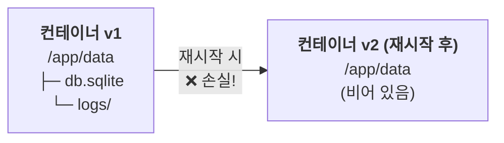
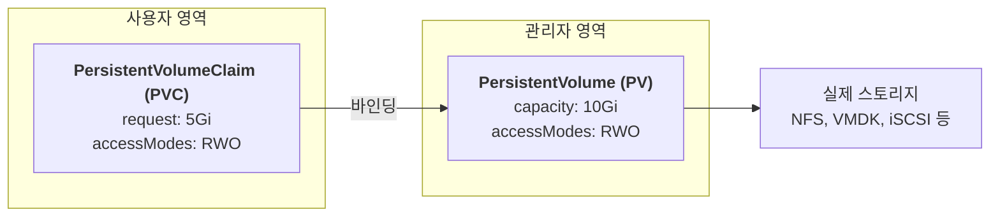

# Ch.08 스토리지 기초: Volume, PV, PVC

## 학습 목표

- 컨테이너의 임시 파일시스템 문제를 이해한다
- 쿠버네티스 볼륨 유형(emptyDir, hostPath)을 이해한다
- PersistentVolume(PV)과 PersistentVolumeClaim(PVC)의 개념과 관계를 이해한다
- Access Mode와 Reclaim Policy를 이해한다

---

## 1. 컨테이너 스토리지의 문제점

### 임시 파일시스템 (Ephemeral Filesystem)

컨테이너는 기본적으로 **임시 파일시스템**을 사용합니다. 이는 다음과 같은 문제를 야기합니다:

- **컨테이너 재시작 시 데이터 손실**: Pod가 재시작되면 컨테이너 내부에 저장된 모든 데이터가 사라집니다
- **컨테이너 간 데이터 공유 불가**: 같은 Pod 내 여러 컨테이너가 데이터를 공유할 수 없습니다
- **데이터베이스 운영 불가**: 영구 저장이 필요한 워크로드(DB, 파일 서버 등)를 실행할 수 없습니다



이 문제를 해결하기 위해 쿠버네티스는 **Volume** 시스템을 제공합니다.

---

## 2. 볼륨 유형 개요

| 볼륨 유형 | 수명 | 저장 위치 | 주요 용도 |
|-----------|------|-----------|-----------|
| `emptyDir` | Pod와 동일 | 노드의 임시 디렉토리 | 컨테이너 간 데이터 공유 |
| `hostPath` | 노드와 동일 | 노드의 특정 경로 | 노드 데이터 접근, 개발/테스트 |
| `persistentVolumeClaim` | 독립적 | 외부 스토리지 (NFS, iSCSI, vSphere 등) | 영구 데이터 저장 |
| `configMap` / `secret` | 리소스와 동일 | etcd | 설정 파일, 민감 정보 |

---

> 💻 **수강생 실습** — 이 섹션은 각자의 lab 네임스페이스에서 직접 실습합니다.

## 3. emptyDir: Pod 내 공유 스토리지

### 특징

- Pod가 노드에 스케줄링될 때 **빈 디렉토리**가 생성됩니다
- 같은 Pod 내 **모든 컨테이너가 공유**할 수 있습니다
- Pod가 삭제되면 **데이터도 함께 삭제**됩니다
- `medium: Memory` 옵션으로 **메모리 기반(tmpfs)** 볼륨을 만들 수 있습니다

### 활용 사례

- 사이드카 패턴: 로그 수집기와 앱 컨테이너 간 로그 파일 공유
- 캐시 데이터 임시 저장
- 컨테이너 간 데이터 전달

### 데모: emptyDir Pod 생성

```bash
# emptyDir Pod 생성
kubectl apply -f examples/emptydir-pod.yaml

# Pod 상태 확인
kubectl get pod emptydir-demo

# 첫 번째 컨테이너(writer)에서 파일 작성
kubectl exec emptydir-demo -c writer -- sh -c 'echo "Hello from writer!" > /data/message.txt'

# 두 번째 컨테이너(reader)에서 파일 읽기
kubectl exec emptydir-demo -c reader -- cat /data/message.txt
```

**예상 출력:**
```
Hello from writer!
```

> 두 컨테이너가 같은 emptyDir 볼륨을 마운트하고 있으므로 데이터가 공유됩니다.

```bash
# 정리
kubectl delete pod emptydir-demo
```

---

## 4. hostPath: 노드 파일시스템 마운트

### 특징

- 노드의 **특정 디렉토리 또는 파일**을 Pod에 마운트합니다
- Pod가 삭제되어도 노드에 데이터가 **남아 있습니다**
- 다른 노드에 재스케줄링되면 **이전 데이터에 접근할 수 없습니다**

### hostPath type 종류

| type | 설명 |
|------|------|
| `""` (빈 문자열) | 검사 없음 (기본값) |
| `DirectoryOrCreate` | 디렉토리가 없으면 생성 |
| `Directory` | 디렉토리가 반드시 존재해야 함 |
| `FileOrCreate` | 파일이 없으면 생성 |
| `File` | 파일이 반드시 존재해야 함 |

### 보안 주의사항

> **경고**: hostPath는 보안상 위험할 수 있습니다.
> - 노드의 파일시스템에 직접 접근하므로, `/etc`, `/var` 등 민감한 경로를 마운트하면 보안 위협이 됩니다
> - 프로덕션 환경에서는 hostPath 사용을 **최소화**해야 합니다
> - PodSecurityPolicy 또는 PodSecurity Admission으로 제한하는 것이 권장됩니다

### 데모: hostPath Pod 확인

```bash
# hostPath Pod YAML 확인
cat examples/hostpath-pod.yaml

# (참고용) hostPath는 노드 파일시스템에 의존하므로 데모에서는 YAML 확인만 진행합니다
```

---

## 5. PersistentVolume (PV): 클러스터 수준의 스토리지

### 왜 PV가 필요한가?

emptyDir은 Pod가 삭제되면 데이터가 사라지고, hostPath는 특정 노드에 종속됩니다. 데이터베이스처럼 **Pod가 재시작되거나 다른 노드로 이동해도 데이터가 유지**되어야 하는 경우에는 외부 스토리지(NFS, 디스크 등)를 사용해야 합니다. PV/PVC는 이 외부 스토리지를 쿠버네티스 안에서 관리하는 표준 방법입니다.

### 개념

PersistentVolume(PV)은 **클러스터 관리자가 프로비저닝한 스토리지 리소스**입니다.

- 클러스터 수준의 리소스 (네임스페이스에 속하지 않음)
- Pod의 수명과 **독립적**으로 존재
- NFS, iSCSI, 클라우드 디스크, vSphere VMDK 등 다양한 백엔드 지원

### PV 스펙 주요 필드

```yaml
apiVersion: v1
kind: PersistentVolume
metadata:
  name: my-pv
spec:
  capacity:
    storage: 5Gi              # 스토리지 용량
  accessModes:
    - ReadWriteOnce            # 접근 모드
  persistentVolumeReclaimPolicy: Retain  # 회수 정책
  storageClassName: ""         # StorageClass (빈 문자열 = 정적 프로비저닝)
  hostPath:                    # 백엔드 스토리지 유형
    path: /mnt/data
```

> ⚠️ **hostPath PV의 한계**
>
> 위 예제는 학습 목적의 hostPath PV입니다. 실무에서는 사용하지 않습니다. 이유:
>
> - **노드 종속**: `DirectoryOrCreate`는 **Pod가 스케줄링된 노드에서만** 디렉토리를 생성합니다. 다른 노드에는 해당 경로가 존재하지 않습니다.
> - **재스케줄링 시 데이터 손실**: Pod가 삭제 후 다른 노드에 재스케줄링되면, 새 노드에서 빈 디렉토리가 생성되어 이전 데이터에 접근할 수 없습니다.
>
> ```
> 1. Pod가 wrk-3에 스케줄링 → wrk-3의 /mnt/data에 디렉토리 생성, 데이터 저장
> 2. Pod 삭제 후 wrk-0에 재스케줄링 → wrk-0에 빈 /mnt/data 생성
>    → wrk-3에 저장했던 데이터는 접근 불가!
>    (wrk-0, wrk-1, wrk-2, wrk-4, wrk-5에는 디렉토리 자체가 없었음)
> ```
>
> 이 문제를 해결하려면 `nodeAffinity`로 Pod를 항상 같은 노드에 고정해야 하지만, 이는 쿠버네티스의 유연한 스케줄링 장점을 포기하는 것입니다.
>
> 그래서 프로덕션에서는 **네트워크 스토리지**(vSphere CSI, NFS, Ceph 등)를 사용합니다. 네트워크 스토리지는 어떤 노드에서든 같은 데이터에 접근할 수 있기 때문입니다. 이것은 Ch.09에서 다룹니다.

### PV/PVC 바인딩과 실제 스토리지의 관계

PV와 PVC는 K8s API 서버(etcd)에 저장되는 **실제 리소스 객체**입니다. 하지만 "바인딩"의 의미는 스토리지 유형에 따라 다릅니다.

**hostPath PV의 경우:**

| 시점 | PV/PVC 상태 | 노드의 실제 디스크 |
|------|-----------|----------------|
| `kubectl apply -f pv.yaml` | PV 생성 (Available) | 아무 일도 안 일어남 |
| `kubectl apply -f pvc.yaml` | PV↔PVC 바인딩 (Bound) | 여전히 아무 일도 안 일어남 |
| **Pod가 wrk-3에 스케줄링** | Bound | **이 순간** wrk-3에서 디렉토리 생성 |

hostPath의 바인딩은 "이 노드 경로를 사용하겠다는 **약속**"에 가깝습니다.

**vSphere CSI PV의 경우 (Ch.09에서 다룸):**

| 시점 | PV/PVC 상태 | 실제 디스크 |
|------|-----------|-----------|
| `kubectl apply -f pvc.yaml` | PVC 생성 (Pending) | 대기 중 |
| **Pod가 스케줄링** | PV 자동 생성 + 바인딩 (Bound) | **vSphere에 VMDK 파일 생성** |
| Pod가 다른 노드로 이동 | Bound 유지 | VMDK를 새 노드에 **attach** (데이터 유지) |

네트워크 스토리지의 바인딩은 **실제 디스크가 생성되고 연결된 상태**입니다. 이것이 hostPath와의 결정적 차이이며, 프로덕션에서 네트워크 스토리지를 쓰는 이유입니다.

---

## 6. PersistentVolumeClaim (PVC): 사용자의 스토리지 요청

### 개념

PersistentVolumeClaim(PVC)은 **사용자(개발자)가 스토리지를 요청**하는 리소스입니다.

- 네임스페이스에 속하는 리소스
- 원하는 용량, 접근 모드 등을 명시
- 쿠버네티스가 조건에 맞는 PV를 자동으로 **바인딩(Binding)**



### PVC 스펙

```yaml
apiVersion: v1
kind: PersistentVolumeClaim
metadata:
  name: my-pvc
  namespace: default
spec:
  accessModes:
    - ReadWriteOnce
  resources:
    requests:
      storage: 5Gi
  storageClassName: ""         # 정적 프로비저닝 시 빈 문자열
```

---

## 7. Access Modes (접근 모드)

| 약어 | 이름 | 설명 |
|------|------|------|
| **RWO** | ReadWriteOnce | 단일 노드에서 읽기/쓰기 마운트 |
| **ROX** | ReadOnlyMany | 여러 노드에서 읽기 전용 마운트 |
| **RWX** | ReadWriteMany | 여러 노드에서 읽기/쓰기 마운트 |
| **RWOP** | ReadWriteOncePod | 단일 Pod에서만 읽기/쓰기 마운트 (K8s 1.27+) |

> **참고**: 모든 스토리지 백엔드가 모든 접근 모드를 지원하는 것은 아닙니다.
> - vSphere CSI: RWO, RWOP 지원
> - NFS: RWO, ROX, RWX 지원

---

## 8. Reclaim Policies (회수 정책)

PVC가 삭제된 후 PV를 어떻게 처리할지 결정합니다.

| 정책 | 동작 | 사용 시나리오 |
|------|------|---------------|
| **Retain** | PV와 데이터를 유지. 관리자가 수동으로 정리 | 중요 데이터 보호 |
| **Delete** | PV와 외부 스토리지(VMDK 등)를 자동 삭제 | 동적 프로비저닝 기본값 |
| **Recycle** | 데이터를 삭제(`rm -rf`)하고 PV를 재사용 | **더 이상 권장하지 않음** |

---

> 🎓 **강사 데모** — PV는 클러스터 레벨 리소스이므로 강사만 생성합니다. 수강생이 동일한 이름의 PV를 생성하면 충돌이 발생합니다. 수강생은 화면을 보며 따라가세요.

## 9. 데모: PV/PVC 생성 및 바인딩 확인

### 9.1 PV 생성

```bash
# PV 생성
kubectl apply -f examples/pv.yaml

# PV 상태 확인 — STATUS가 "Available"이어야 합니다
kubectl get pv
```

**예상 출력:**
```
NAME      CAPACITY   ACCESS MODES   RECLAIM POLICY   STATUS      CLAIM   STORAGECLASS   AGE
demo-pv   1Gi        RWO            Retain           Available                          5s
```

### 9.2 PVC 생성

```bash
# PVC 생성
kubectl apply -f examples/pvc.yaml

# PVC 상태 확인 — STATUS가 "Bound"이어야 합니다
kubectl get pvc
```

**예상 출력:**
```
NAME       STATUS   VOLUME    CAPACITY   ACCESS MODES   STORAGECLASS   AGE
demo-pvc   Bound    demo-pv   1Gi        RWO                           3s
```

### 9.3 PV 상태 재확인

```bash
# PV가 PVC에 바인딩되었는지 확인
kubectl get pv
```

**예상 출력:**
```
NAME      CAPACITY   ACCESS MODES   RECLAIM POLICY   STATUS   CLAIM              STORAGECLASS   AGE
demo-pv   1Gi        RWO            Retain           Bound    default/demo-pvc                  30s
```

> STATUS가 `Available` → `Bound`로 변경되었고, CLAIM 열에 바인딩된 PVC가 표시됩니다.

### 9.4 PVC를 사용하는 Pod 생성 — 데이터 쓰기

PV/PVC가 바인딩되었으므로, 이제 Pod에서 PVC를 마운트하여 실제로 데이터를 저장해 봅니다.

```bash
kubectl apply -f examples/pvc-writer-pod.yaml
```

```bash
# Pod가 Running 상태인지 확인
kubectl get pod pvc-writer
```

**예상 출력:**
```
NAME         READY   STATUS    RESTARTS   AGE
pvc-writer   1/1     Running   0          10s
```

```bash
# Pod 안에서 저장된 데이터 확인
kubectl exec pvc-writer -- cat /data/test.txt
```

**예상 출력:**
```
PV test data from Kubernetes
```

> PVC를 통해 PV에 데이터가 저장되었습니다. 이 데이터는 Pod가 삭제되어도 PV에 남아 있습니다.

### 9.5 상세 정보 확인

```bash
# PV 상세 정보
kubectl describe pv demo-pv

# PVC 상세 정보
kubectl describe pvc demo-pvc
```

### 9.6 정리

```bash
kubectl delete pod pvc-writer
kubectl delete pvc demo-pvc
kubectl delete pv demo-pv
```

---

## 핵심 요약

| 개념 | 설명 |
|------|------|
| **emptyDir** | Pod 수명과 동일한 임시 공유 볼륨 |
| **hostPath** | 노드 파일시스템 직접 마운트 (보안 주의) |
| **PV** | 클러스터 관리자가 프로비저닝한 스토리지 리소스 |
| **PVC** | 사용자의 스토리지 요청, PV와 바인딩 |
| **Access Mode** | RWO, ROX, RWX, RWOP — 접근 방식 결정 |
| **Reclaim Policy** | Retain, Delete — PVC 삭제 후 PV 처리 방식 |

---

> **다음 챕터**: [Ch.09 StorageClass와 동적 프로비저닝](../ch09-storageclass/README.md)
