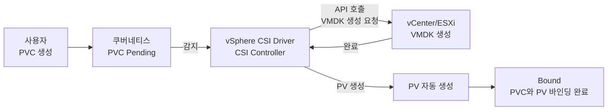

# Ch.09 StorageClass와 동적 프로비저닝

## 학습 목표

- 정적 프로비저닝과 동적 프로비저닝의 차이를 이해한다
- StorageClass의 개념과 주요 필드를 이해한다
- vSphere CSI Driver의 동작 원리를 이해한다
- 동적 프로비저닝으로 PVC를 생성하고 PV가 자동 생성되는 것을 확인한다

---

## 1. 정적 프로비저닝 vs 동적 프로비저닝

### 정적 프로비저닝 (Static Provisioning)

Ch.08에서 실습한 방식입니다:

1. 관리자가 **PV를 미리 생성**
2. 사용자가 PVC를 생성
3. 쿠버네티스가 조건에 맞는 PV를 찾아 바인딩

```
관리자: PV 생성 → PV 생성 → PV 생성 → ...  (수동, 번거로움)
사용자: PVC 요청 ────────────────────────── 바인딩
```

**문제점**: 스토리지 요청이 많아지면 관리자가 매번 PV를 수동 생성해야 합니다.

### 동적 프로비저닝 (Dynamic Provisioning)

StorageClass를 사용하면:

1. 관리자가 **StorageClass를 한 번 정의**
2. 사용자가 PVC를 생성할 때 StorageClass를 지정
3. CSI Driver가 **PV를 자동으로 생성**하고 바인딩

```
관리자: StorageClass 정의 (1회)
사용자: PVC 요청 ──→ CSI Driver가 자동으로 PV 생성 + 외부 스토리지 프로비저닝 ──→ 바인딩
```

---

## 2. StorageClass 개념

StorageClass는 **스토리지의 "클래스(등급)"를 정의**하는 리소스입니다.

### 주요 필드

```yaml
apiVersion: storage.k8s.io/v1
kind: StorageClass
metadata:
  name: vsphere-csi
  annotations:
    storageclass.kubernetes.io/is-default-class: "true"   # 기본 StorageClass
provisioner: csi.vsphere.vmware.com                       # CSI 드라이버 이름
parameters:                                                # 프로비저너별 파라미터
  storagepolicyname: "kubernetes-storage-policy"
reclaimPolicy: Delete                                      # 회수 정책
volumeBindingMode: WaitForFirstConsumer                    # 바인딩 시점
allowVolumeExpansion: true                                 # 볼륨 확장 허용
```

| 필드 | 설명 |
|------|------|
| `provisioner` | 스토리지를 프로비저닝할 CSI 드라이버 |
| `parameters` | 프로비저너에 전달할 설정값 |
| `reclaimPolicy` | PVC 삭제 시 PV 처리 방식 (Delete 또는 Retain) |
| `volumeBindingMode` | `Immediate`: PVC 생성 즉시 바인딩, `WaitForFirstConsumer`: Pod가 스케줄링될 때 바인딩 |
| `allowVolumeExpansion` | PVC 용량 확장 허용 여부 |

---

## 3. vSphere CSI Driver

### 동작 원리

우리 클러스터는 **VMware vSphere** 위에서 동작하며, **vSphere CSI Driver v3.7.0**이 설치되어 있습니다.



### vSphere에서의 저장 위치

- **데이터스토어**: `02-Container-Storage`
- PVC를 생성하면 해당 데이터스토어에 **VMDK 파일**이 생성됩니다
- VMDK는 ESXi 호스트의 가상 디스크 형식입니다

---

## 4. 현재 클러스터 설정 확인

### 4.1 StorageClass 확인

```bash
kubectl get storageclass
```

**예상 출력:**
```
NAME                    PROVISIONER              RECLAIMPOLICY   VOLUMEBINDINGMODE       ALLOWVOLUMEEXPANSION   AGE
vsphere-csi (default)   csi.vsphere.vmware.com   Delete          WaitForFirstConsumer    true                   30d
```

> `(default)` 표시는 이 StorageClass가 기본값임을 의미합니다. PVC에서 `storageClassName`을 생략하면 이 StorageClass가 자동으로 적용됩니다.

### 4.2 StorageClass 상세 정보

```bash
kubectl describe storageclass vsphere-csi
```

### 4.3 CSI Driver 확인

```bash
kubectl get csidrivers
```

**예상 출력:**
```
NAME                     ATTACHREQUIRED   PODINFOONMOUNT   STORAGECAPACITY   TOKENREQUESTS   REQUIRESREPUBLISH   MODES        AGE
csi.vsphere.vmware.com   true             false            false             <unset>         false               Persistent   30d
```

---

> 💻 **수강생 실습** — 이 섹션은 각자의 lab 네임스페이스에서 직접 실습합니다.

## 5. 데모: 동적 프로비저닝

### 5.1 PVC 생성 (PV 없이!)

Ch.08에서는 PV를 먼저 생성했지만, 이번에는 **PVC만 생성**합니다.

```bash
# PVC 생성
kubectl apply -f examples/dynamic-pvc.yaml

# PVC 상태 확인
kubectl get pvc dynamic-demo-pvc
```

**예상 출력:**
```
NAME               STATUS    VOLUME   CAPACITY   ACCESS MODES   STORAGECLASS   AGE
dynamic-demo-pvc   Pending                                      vsphere-csi    5s
```

> STATUS가 `Pending`인 이유: `volumeBindingMode: WaitForFirstConsumer`이므로 Pod가 이 PVC를 사용할 때까지 대기합니다.

### 5.2 PVC를 사용하는 Pod 생성

PVC를 사용하는 Pod를 생성하면 `WaitForFirstConsumer` 모드에 의해 비로소 PV가 프로비저닝됩니다.

```bash
# PVC를 마운트하는 Pod 생성
kubectl run dynamic-pvc-test --image=busybox:1.37 --restart=Never \
  --overrides='{
    "spec": {
      "containers": [{
        "name": "test",
        "image": "busybox:1.37",
        "command": ["sh", "-c", "echo 동적 프로비저닝 테스트 > /data/test.txt && cat /data/test.txt && sleep 3600"],
        "volumeMounts": [{"name": "vol", "mountPath": "/data"}]
      }],
      "volumes": [{"name": "vol", "persistentVolumeClaim": {"claimName": "dynamic-demo-pvc"}}]
    }
  }'
```

> **참고**: Pod 생성 후 vSphere CSI가 VMDK를 생성하므로 10~30초 정도 소요될 수 있습니다.

Pod가 스케줄링되면:

```bash
# Pod 생성 후 PVC 상태 변화 확인
kubectl get pvc dynamic-demo-pvc
```

**예상 출력 (Pod 생성 후):**
```
NAME               STATUS   VOLUME                                     CAPACITY   ACCESS MODES   STORAGECLASS   AGE
dynamic-demo-pvc   Bound    pvc-a1b2c3d4-e5f6-7890-abcd-ef1234567890   5Gi        RWO            vsphere-csi    30s
```

> PV가 자동으로 생성되고 (`pvc-` 접두사 + UUID), STATUS가 `Bound`로 변경됩니다.

### 5.3 자동 생성된 PV 확인

```bash
# PV 목록 — 관리자가 만들지 않은 PV가 자동으로 생성됨
kubectl get pv
```

**예상 출력:**
```
NAME                                       CAPACITY   ACCESS MODES   RECLAIM POLICY   STATUS   CLAIM                      STORAGECLASS   AGE
pvc-a1b2c3d4-e5f6-7890-abcd-ef1234567890   5Gi        RWO            Delete           Bound    default/dynamic-demo-pvc   vsphere-csi    25s
```

### 5.4 vSphere에서 VMDK 확인

vSphere Client에서 확인하면:
- **데이터스토어**: `02-Container-Storage`
- **경로**: `kubevols/` 디렉토리 아래에 VMDK 파일이 생성됨
- **파일명**: PV 이름과 동일한 이름의 `.vmdk` 파일

### 5.5 정리

```bash
kubectl delete pod dynamic-pvc-test 2>/dev/null
kubectl delete pvc dynamic-demo-pvc
# PVC 삭제 시 reclaimPolicy가 Delete이므로 PV와 VMDK도 자동 삭제됨
```

---

## 핵심 요약

| 개념 | 설명 |
|------|------|
| **정적 프로비저닝** | 관리자가 PV를 수동 생성 → PVC 바인딩 |
| **동적 프로비저닝** | StorageClass + CSI Driver가 PV를 자동 생성 |
| **StorageClass** | 스토리지 등급 정의: 프로비저너, 파라미터, 회수 정책 |
| **vSphere CSI** | vCenter API를 통해 VMDK를 자동 생성/삭제 |
| **WaitForFirstConsumer** | Pod 스케줄링 시점까지 볼륨 바인딩 지연 |
| **기본 StorageClass** | PVC에서 storageClassName 생략 시 자동 적용 |

---

> **다음 챕터**: [Ch.10 데이터베이스 on Kubernetes: StatefulSet과 MySQL](../ch10-db-on-k8s/README.md)
