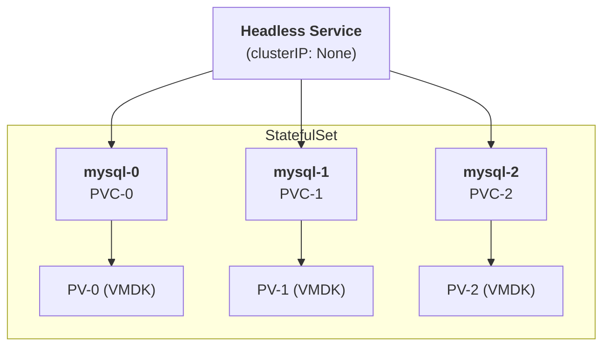

# Ch.10 데이터베이스 on Kubernetes: StatefulSet과 MySQL

## 학습 목표

- StatefulSet과 Deployment의 차이를 이해한다
- StatefulSet의 구성 요소(Headless Service, volumeClaimTemplates)를 이해한다
- MySQL을 쿠버네티스에 배포하고 데이터 영속성을 직접 확인한다

---

## 1. StatefulSet vs Deployment

### Deployment의 한계

Deployment는 **상태가 없는(Stateless)** 애플리케이션에 적합합니다:
- Pod 이름이 랜덤 (`nginx-7d9f8b6c4-x2k9p`)
- Pod 순서 보장 없음 (동시에 생성/삭제)
- 스토리지가 공유됨 (모든 Pod가 같은 PVC 사용)

### StatefulSet이 필요한 이유

데이터베이스 같은 **상태가 있는(Stateful)** 애플리케이션은 다음이 필요합니다:

| 특성 | Deployment | StatefulSet |
|------|-----------|-------------|
| **Pod 이름** | 랜덤 (`app-7d9f8-x2k9p`) | 순번 고정 (`mysql-0`, `mysql-1`) |
| **생성/삭제 순서** | 순서 없음 (동시) | 순서 보장 (0→1→2 생성, 2→1→0 삭제) |
| **네트워크 ID** | 변경됨 | 고정 DNS (`mysql-0.mysql-svc.ns.svc.cluster.local`) |
| **스토리지** | 공유 PVC | Pod별 개별 PVC (`volumeClaimTemplates`) |

### StatefulSet 구성 요소



**핵심 구성 요소:**
1. **Headless Service** (`clusterIP: None`): Pod별 고유 DNS를 제공
2. **volumeClaimTemplates**: Pod별 개별 PVC를 자동 생성

---

## 1.1 Headless Service와 MySQL

> Ch.05에서 배운 Headless Service를 기억하시나요? `clusterIP: None`으로 설정하면 ClusterIP 없이 Pod IP를 직접 반환하고, StatefulSet과 함께 쓰면 `pod-name.svc-name`으로 특정 Pod를 지정 호출할 수 있었습니다. (상세 비교표와 데모는 [Ch.05 Service Networking](../../day1/ch05-service-networking/README.md)을 참고하세요.)

### MySQL에 Headless Service가 필요한 이유

**1. StatefulSet의 필수 요구사항**

StatefulSet은 `serviceName` 필드에 Headless Service 이름을 지정해야 합니다. MySQL replica가 1개뿐이라도 StatefulSet을 사용한다면 Headless Service는 **필수**입니다. 이를 통해 `mysql-0.mysql-svc` 형태의 안정적인 DNS를 얻습니다.

**2. Master-Slave 구성 시 Master 지정**

MySQL Master-Slave(복제) 구성에서는 쓰기 요청을 반드시 Master에만 보내야 합니다. Headless Service 덕분에 `mysql-0.mysql-svc`로 Master Pod에 직접 접근할 수 있습니다. 일반 Service로는 어떤 Pod가 응답할지 알 수 없어 이 구성이 불가능합니다.

**3. 분산 DB (Galera, Vitess 등)**

분산 DB 클러스터에서는 각 노드가 서로를 DNS로 찾아야 합니다. Headless Service를 통해 `mysql-0.mysql-svc`, `mysql-1.mysql-svc`, `mysql-2.mysql-svc`로 노드 간 직접 통신이 가능합니다.

### 간단 확인 (이미 Ch.05에서 데모를 진행했으므로 결과만 확인)

```bash
# Headless Service 확인 (CLUSTER-IP가 None인 것에 주목)
kubectl get svc -n db-demo

# 예상 출력:
# NAME        TYPE        CLUSTER-IP   EXTERNAL-IP   PORT(S)    AGE
# mysql-svc   ClusterIP   None         <none>        3306/TCP   5m

# 개별 Pod DNS 확인
kubectl run dns-test -n db-demo --image=busybox:1.36 --rm -it --restart=Never -- \
  nslookup mysql-0.mysql-svc.db-demo.svc.cluster.local
# → mysql-0 Pod의 IP 반환 (Pod가 재시작되어도 항상 같은 Pod를 가리킴)
```

---

> 🎓 **강사 데모** — 이 섹션은 강사가 시연합니다. 수강생들은 Headlamp이나 Grafana에서 결과를 확인할 수 있습니다.

## 2. MySQL on Kubernetes: 단계별 실습

> **중요**: 아래 명령어를 순서대로 하나씩 실행하세요. 모든 명령어는 복사-붙여넣기로 실행할 수 있습니다.

### 2.1 네임스페이스 생성

```bash
kubectl create namespace db-demo
```

**예상 출력:**
```
namespace/db-demo created
```

**확인:**
```bash
kubectl get namespace db-demo
```

**예상 출력:**
```
NAME      STATUS   AGE
db-demo   Active   5s
```

---

### 2.2 MySQL 루트 비밀번호 Secret 생성

MySQL의 루트 비밀번호를 Secret으로 저장합니다.

```bash
kubectl apply -f examples/mysql-secret.yaml
```

**예상 출력:**
```
secret/mysql-secret created
```

**확인:**
```bash
kubectl get secret -n db-demo
```

**예상 출력:**
```
NAME           TYPE     DATA   AGE
mysql-secret   Opaque   1      5s
```

> Secret의 데이터는 base64로 인코딩되어 있습니다. 실제 비밀번호: `Training2026!`

---

### 2.3 PVC 생성 (영속 스토리지)

StatefulSet과 **독립적으로** PVC를 먼저 생성합니다. 이렇게 하면 StatefulSet을 삭제해도 PVC(데이터)는 보존됩니다.

```bash
kubectl apply -f examples/mysql-pvc.yaml
```

**예상 출력:**
```
persistentvolumeclaim/mysql-data created
```

```bash
kubectl get pvc -n db-demo
```

**예상 출력:**
```
NAME         STATUS    VOLUME   CAPACITY   ACCESS MODES   STORAGECLASS   AGE
mysql-data   Pending                                      vsphere-csi    5s
```

> `Pending` 상태는 정상입니다. vSphere CSI의 `WaitForFirstConsumer` 모드로 인해 Pod가 마운트할 때 실제 PV가 생성됩니다.

---

### 2.4 Headless Service + StatefulSet 배포

```bash
kubectl apply -f examples/mysql-service.yaml
kubectl apply -f examples/mysql-statefulset.yaml
```

**예상 출력:**
```
service/mysql-svc created
statefulset.apps/mysql created
```

---

### 2.5 Pod가 준비될 때까지 대기

StatefulSet은 Pod를 순서대로 생성합니다. mysql-0 Pod가 Ready 상태가 될 때까지 기다립니다.

```bash
kubectl get pods -n db-demo -w
```

**예상 출력 (시간 경과에 따라):**
```
NAME      READY   STATUS    RESTARTS   AGE
mysql-0   0/1     Pending   0          0s
mysql-0   0/1     Pending   0          3s
mysql-0   0/1     ContainerCreating   0          5s
mysql-0   0/1     Running   0          15s
mysql-0   1/1     Running   0          25s
```

> Pod가 `1/1 Running` 상태가 되면 `Ctrl+C`를 눌러 watch를 중단합니다.

**STATUS가 Pending에서 오래 멈춰 있다면:**
- vSphere CSI가 VMDK를 생성하는 중입니다 (약 10~30초 소요)
- `kubectl describe pod mysql-0 -n db-demo` 명령으로 이벤트를 확인할 수 있습니다

---

### 2.6 PVC 바인딩 확인

Pod가 시작되면서 PVC가 PV에 바인딩됩니다 (vSphere CSI가 VMDK를 자동 생성).

```bash
kubectl get pvc -n db-demo
```

**예상 출력:**
```
NAME         STATUS   VOLUME                                     CAPACITY   ACCESS MODES   STORAGECLASS   AGE
mysql-data   Bound    pvc-xxxxxxxx-xxxx-xxxx-xxxx-xxxxxxxxxxxx   5Gi        RWO            vsphere-csi    60s
```

> `STATUS: Bound` — PVC가 PV에 성공적으로 바인딩되었습니다. vSphere 데이터스토어에 5GiB VMDK가 생성된 것입니다.

**PV도 함께 확인:**
```bash
kubectl get pv | grep db-demo
```

**예상 출력:**
```
pvc-xxxxxxxx-xxxx-xxxx-xxxx-xxxxxxxxxxxx   5Gi   RWO   Delete   Bound   db-demo/mysql-data   vsphere-csi   60s
```

---

### 2.7 MySQL 접속

이제 mysql-0 Pod에 접속하여 MySQL 클라이언트를 실행합니다.

```bash
kubectl exec -it mysql-0 -n db-demo -- mysql -uroot -p'Training2026!'
```

**예상 출력:**
```
mysql: [Warning] Using a password on the command line interface can be insecure.
Welcome to the MySQL monitor.  Commands end with ; or \g.
Your MySQL connection id is 8
Server version: 8.0.xx MySQL Community Server - GPL

Copyright (c) 2000, 2024, Oracle and/or its affiliates.

Oracle is a registered trademark of Oracle Corporation and/or its
affiliates. Other names may be trademarks of their respective
owners.

Type 'help;' or '\h' for help. Type '\c' to clear the current input statement.

mysql>
```

> `mysql>` 프롬프트가 나타나면 성공적으로 접속된 것입니다.

---

### 2.8 데이터베이스 및 테이블 생성, 데이터 입력

아래 SQL 명령어를 **하나씩** 복사하여 `mysql>` 프롬프트에 붙여넣으세요.

**데이터베이스 생성:**
```sql
CREATE DATABASE students;
```

**예상 출력:**
```
Query OK, 1 row affected (0.01 sec)
```

**데이터베이스 선택:**
```sql
USE students;
```

**예상 출력:**
```
Database changed
```

**테이블 생성:**
```sql
CREATE TABLE enrollments (
  id INT AUTO_INCREMENT PRIMARY KEY,
  name VARCHAR(100),
  department VARCHAR(100),
  enrolled_at TIMESTAMP DEFAULT CURRENT_TIMESTAMP
);
```

**예상 출력:**
```
Query OK, 0 rows affected (0.03 sec)
```

**데이터 입력:**
```sql
INSERT INTO enrollments (name, department) VALUES
  ('Alice Kim', 'DevOps'),
  ('Bob Lee', 'Backend'),
  ('Charlie Park', 'Infrastructure');
```

**예상 출력:**
```
Query OK, 3 rows affected (0.01 sec)
Records: 3  Duplicates: 0  Warnings: 0
```

**데이터 조회:**
```sql
SELECT * FROM enrollments;
```

**예상 출력:**
```
+----+--------------+----------------+---------------------+
| id | name         | department     | enrolled_at         |
+----+--------------+----------------+---------------------+
|  1 | Alice Kim    | DevOps         | 2026-04-06 09:30:00 |
|  2 | Bob Lee      | Backend        | 2026-04-06 09:30:00 |
|  3 | Charlie Park | Infrastructure | 2026-04-06 09:30:00 |
+----+--------------+----------------+---------------------+
3 rows in set (0.00 sec)
```

> enrolled_at의 시간은 실행 시점에 따라 다를 수 있습니다.

**MySQL 종료:**
```sql
EXIT;
```

**예상 출력:**
```
Bye
```

---

### 2.9 데이터 영속성 테스트: StatefulSet 전체 삭제

이제 핵심 테스트입니다. Pod가 아니라 **StatefulSet 자체를 완전히 삭제**합니다.

```bash
kubectl delete statefulset mysql -n db-demo
```

**예상 출력:**
```
statefulset.apps "mysql" deleted
```

Pod가 완전히 사라진 것을 확인합니다:
```bash
kubectl get pods -n db-demo
```

**예상 출력:**
```
No resources found in db-demo namespace.
```

---

### 2.10 PVC가 살아있는지 확인

StatefulSet과 Pod는 삭제되었지만, **PVC는 여전히 남아있습니다:**

```bash
kubectl get pvc -n db-demo
```

**예상 출력:**
```
NAME         STATUS   VOLUME                                     CAPACITY   ACCESS MODES   STORAGECLASS   AGE
mysql-data   Bound    pvc-xxxxxxxx-xxxx-xxxx-xxxx-xxxxxxxxxxxx   5Gi        RWO            vsphere-csi    5m
```

> **핵심 포인트**: StatefulSet을 삭제해도 PVC는 독립적으로 존재합니다. PVC 안의 데이터(vSphere VMDK)도 그대로입니다.

---

### 2.11 StatefulSet 재생성 → 같은 PVC에 연결

StatefulSet을 다시 배포합니다. 같은 PVC 이름(`mysql-data`)을 참조하므로 기존 데이터가 자동으로 연결됩니다:

```bash
kubectl apply -f examples/mysql-statefulset.yaml
```

Pod가 Ready 될 때까지 대기:
```bash
kubectl get pods -n db-demo -w
```

**예상 출력:**
```
NAME      READY   STATUS              RESTARTS   AGE
mysql-0   0/1     ContainerCreating   0          2s
mysql-0   0/1     Running             0          5s
mysql-0   1/1     Running             0          15s
```

> `1/1 Running`이 되면 `Ctrl+C`로 watch를 중단합니다.

---

### 2.12 데이터 영속성 확인: 재접속 후 데이터 조회

MySQL에 다시 접속합니다:

```bash
kubectl exec -it mysql-0 -n db-demo -- mysql -uroot -p'Training2026!'
```

**예상 출력:** (이전과 동일한 MySQL 프롬프트)

이제 데이터가 그대로 있는지 확인합니다:

```sql
SELECT * FROM students.enrollments;
```

**예상 출력:**
```
+----+--------------+----------------+---------------------+
| id | name         | department     | enrolled_at         |
+----+--------------+----------------+---------------------+
|  1 | Alice Kim    | DevOps         | 2026-04-06 09:30:00 |
|  2 | Bob Lee      | Backend        | 2026-04-06 09:30:00 |
|  3 | Charlie Park | Infrastructure | 2026-04-06 09:30:00 |
+----+--------------+----------------+---------------------+
3 rows in set (0.00 sec)
```

> **데이터가 그대로 남아 있습니다!**
>
> 이것이 PersistentVolume의 핵심입니다:
> - Pod가 삭제되어도 PVC와 PV는 그대로 유지됩니다
> - StatefulSet은 같은 이름의 Pod를 재생성하고 같은 PVC를 다시 마운트합니다
> - 따라서 vSphere VMDK에 저장된 MySQL 데이터가 그대로 보존됩니다

```sql
EXIT;
```

---

### 2.13 리소스 상태 최종 확인

```bash
# 모든 리소스 확인
kubectl get all,pvc -n db-demo
```

**예상 출력:**
```
NAME          READY   STATUS    RESTARTS   AGE
pod/mysql-0   1/1     Running   0          2m

NAME                TYPE        CLUSTER-IP   EXTERNAL-IP   PORT(S)    AGE
service/mysql-svc   ClusterIP   None         <none>        3306/TCP   5m

NAME                     READY   AGE
statefulset.apps/mysql   1/1     5m

NAME                                       STATUS   VOLUME                                     CAPACITY   ACCESS MODES   STORAGECLASS   AGE
persistentvolumeclaim/mysql-data-mysql-0   Bound    pvc-xxxxxxxx-xxxx-xxxx-xxxx-xxxxxxxxxxxx   5Gi        RWO            vsphere-csi    5m
```

---

### 2.14 정리

실습이 끝나면 네임스페이스를 삭제하여 모든 리소스를 정리합니다.

```bash
kubectl delete namespace db-demo
```

**예상 출력:**
```
namespace "db-demo" deleted
```

> **참고**: 네임스페이스 삭제 시 해당 네임스페이스의 모든 리소스(Pod, Service, StatefulSet, PVC)가 함께 삭제됩니다.
> PVC가 삭제되면 reclaimPolicy가 `Delete`이므로 PV와 vSphere VMDK도 자동 삭제됩니다.
> 삭제에 1~2분 정도 소요될 수 있습니다.

**정리 확인:**
```bash
kubectl get pv | grep db-demo
```

**예상 출력:** (아무것도 출력되지 않으면 정상)

---

## 핵심 요약

| 개념 | 설명 |
|------|------|
| **StatefulSet** | 상태가 있는 앱을 위한 워크로드 (안정적 이름, 순서 보장, 개별 스토리지) |
| **Headless Service** | `clusterIP: None`으로 설정, Pod별 고유 DNS 제공 |
| **volumeClaimTemplates** | Pod별 개별 PVC를 자동 생성하는 StatefulSet의 기능 |
| **데이터 영속성** | Pod가 삭제/재생성되어도 PVC→PV→VMDK의 데이터는 보존됨 |

---

## 3. 실무 팁: 앱에서 DB에 접근하는 3가지 패턴

오늘 실습에서는 `mysql-0.mysql-svc` (Headless Service FQDN)으로 직접 Pod를 지정하여 MySQL에 접속했습니다. 단일 인스턴스에서는 이것으로 충분하지만, **Primary-Standby HA 구성**에서는 중요한 질문이 생깁니다:

> "앱이 Primary Pod를 직접 가리키고 있는데, Primary가 죽으면 어떻게 Standby로 전환하나요?"

이 문제를 해결하는 3가지 패턴이 있습니다.

### 패턴 1: Headless Service FQDN 직접 지정

```
앱 → mysql-0.mysql-svc (Primary 고정)
```

- 가장 단순하지만, **Primary 장애 시 자동 Failover 불가**
- 앱의 DB 연결 설정을 수동으로 `mysql-1.mysql-svc`로 변경해야 함
- **적합한 경우**: 개발/테스트 환경, 단일 인스턴스 (오늘 실습이 이 방식)

### 패턴 2: Label Selector 기반 Service

```
앱 → mysql-primary (ClusterIP Service, selector: role=primary)
                    └→ 평소: mysql-0 (Primary)
                    └→ Failover 후: mysql-1 (새 Primary)
```

```yaml
# 쓰기 전용 Service
apiVersion: v1
kind: Service
metadata:
  name: mysql-primary
spec:
  selector:
    app: mysql
    role: primary        # ← 이 label을 가진 Pod만 선택
  ports:
    - port: 3306

# 읽기 전용 Service (Headless — Replica들에 분산)
apiVersion: v1
kind: Service
metadata:
  name: mysql-read
spec:
  clusterIP: None
  selector:
    app: mysql
    role: replica
  ports:
    - port: 3306
```

- Failover 시 Operator가 **Pod의 label(`role`)을 자동 변경** → Service가 새 Primary를 가리킴
- 앱은 `mysql-primary`를 그대로 사용 (설정 변경 불필요)
- **적합한 경우**: DB Operator 기반 HA 구성

### 패턴 3: DB 프록시 (프로덕션에서 가장 일반적)

```
앱 → ProxySQL / PgBouncer → Primary Pod
                            프록시가 자동으로:
                            - Primary 헬스체크
                            - 장애 감지 시 Standby로 전환
                            - Read/Write 분리
                            - 커넥션 풀링
```

| 프록시 | 대상 DB | 주요 기능 |
|--------|---------|----------|
| **ProxySQL** | MySQL | 쿼리 라우팅, Read/Write 분리, 자동 Failover, 커넥션 풀링 |
| **PgBouncer** | PostgreSQL | 커넥션 풀링, Failover (CNPG에 내장) |
| **MaxScale** | MariaDB | 쿼리 라우팅, 모니터링, Failover |

- 앱은 프록시 주소만 알면 됨 → Primary/Standby를 몰라도 됨
- 프록시가 모든 장애 처리를 담당
- **적합한 경우**: 프로덕션 HA 환경

### 그렇다면 Headless Service는 왜 필요한가?

Headless Service의 Pod별 DNS(`mysql-0.mysql-svc`, `mysql-1.mysql-svc`)는 **앱이 직접 사용하는 것이 아니라**, DB 노드 간 내부 통신에 사용됩니다:

```
[mysql-0 (Primary)] ──── Replication ────→ [mysql-1 (Standby)]
     mysql-0.mysql-svc                          mysql-1.mysql-svc
     ↑                                          
     Headless Service DNS로 서로를 찾음
```

| 접근 주체 | 사용하는 엔드포인트 | 이유 |
|-----------|-------------------|------|
| **앱 (쓰기)** | `mysql-primary` (Service) 또는 프록시 | 자동 Failover 필요 |
| **앱 (읽기)** | `mysql-read` (Headless) 또는 프록시 | Replica 분산 |
| **DB 노드 간** | `mysql-0.mysql-svc` (Headless FQDN) | Replication, 클러스터 통신 |

---

## 4. 더 나아가기: CloudNativePG (CNPG)

지금까지 StatefulSet으로 MySQL을 직접 배포하는 방법을 배웠습니다. 이 방식은 동작하지만, 프로덕션 환경에서는 다음과 같은 한계가 있습니다:

- **자동 Failover 없음**: Master Pod가 죽으면 수동으로 복구해야 합니다
- **백업/복원이 수동**: 별도 CronJob으로 mysqldump 등을 설정해야 합니다
- **레플리카 관리가 복잡**: Master-Slave 구성, 리플리케이션 설정을 직접 해야 합니다
- **모니터링 별도 구성**: Exporter를 직접 붙여야 합니다

### Kubernetes Operator 패턴

이러한 운영 복잡성을 해결하기 위해 **Operator 패턴**이 등장했습니다.

Operator는 "사람 운영자(Operator)의 지식을 코드로 자동화"한 것입니다:

```
일반 StatefulSet 방식:
  사람이 직접 → DB 설치 → 리플리케이션 설정 → 백업 스크립트 → 장애 복구

Operator 방식:
  YAML 한 장 작성 → Operator가 자동으로 모든 것을 관리
```

### CloudNativePG란?

[CloudNativePG](https://cloudnative-pg.io/)는 **PostgreSQL 전용 Kubernetes Operator**입니다.

```yaml
# CNPG로 PostgreSQL 클러스터를 생성하는 예시 (이것만 작성하면 끝!)
apiVersion: postgresql.cnpg.io/v1
kind: Cluster
metadata:
  name: my-postgres
spec:
  instances: 3              # Primary 1 + Standby 2 자동 구성
  storage:
    size: 10Gi
    storageClass: vsphere-csi
  backup:
    barmanObjectStore:       # 자동 백업 (S3/MinIO)
      destinationPath: s3://backups/
```

이 YAML 하나로 CNPG Operator가 자동으로:

| 기능 | 설명 |
|------|------|
| **HA 구성** | Primary 1대 + Standby 2대 자동 구성, 동기 리플리케이션 |
| **자동 Failover** | Primary 장애 시 Standby가 15초 내 자동 승격 |
| **자동 백업** | Barman 기반 연속 백업 (PITR: Point-in-Time Recovery) |
| **Rolling Update** | PostgreSQL 버전 업그레이드 시 무중단 순차 업데이트 |
| **모니터링** | Prometheus 메트릭 자동 노출, Grafana 대시보드 제공 |
| **TLS** | Pod 간 암호화 통신 자동 설정 |
| **Connection Pooling** | PgBouncer 내장 |

### 주요 DB Operator 비교

| Operator | DB | 특징 |
|----------|-----|------|
| **CloudNativePG** | PostgreSQL | CNCF Sandbox 프로젝트, 가장 활발한 커뮤니티 |
| **Percona Operator** | MySQL/PostgreSQL/MongoDB | Percona 지원, 엔터프라이즈급 |
| **Zalando Postgres Operator** | PostgreSQL | Zalando 개발, Patroni 기반 |
| **MySQL Operator (Oracle)** | MySQL | Oracle 공식, InnoDB Cluster 관리 |
| **Strimzi** | Apache Kafka | Kafka 전용 Operator |

### StatefulSet vs Operator: 언제 무엇을 쓸까?

| 상황 | 추천 |
|------|------|
| 학습/개발 환경 | StatefulSet (오늘 실습한 방식) |
| 프로덕션 단일 인스턴스 | StatefulSet + 백업 스크립트 |
| 프로덕션 HA | **Operator 사용 권장** |
| 미션 크리티컬 | **Operator + 모니터링 + 백업 필수** |

> **정리**: 오늘 실습한 StatefulSet 방식은 DB on K8s의 **기본 원리**를 이해하는 데 중요합니다.
> 실무에서는 이 원리 위에 Operator를 얹어서 운영 자동화를 달성합니다.
> "StatefulSet이 기초 체력, Operator가 실전 무기"라고 생각하면 됩니다.

---

> **다음 챕터**: [Ch.11 HPA: Horizontal Pod Autoscaler](../ch11-hpa-autoscaling/README.md)
