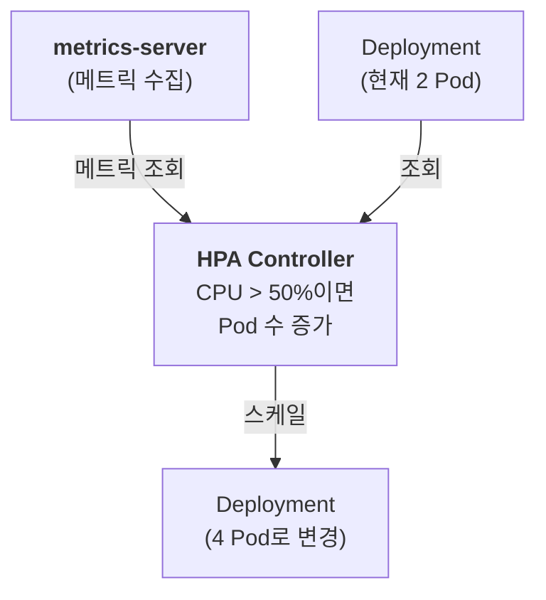

# Ch.11 HPA: Horizontal Pod Autoscaler

## 학습 목표

- HPA(Horizontal Pod Autoscaler)의 개념과 동작 원리를 이해한다
- metrics-server의 역할을 이해한다
- HPA의 스케일링 알고리즘을 이해한다
- 부하 테스트 도구를 사용하여 오토스케일링을 직접 관찰한다

---

## 1. HPA란 무엇인가?

HPA(Horizontal Pod Autoscaler)는 **CPU 사용량, 메모리 사용량, 또는 커스텀 메트릭**을 기반으로 **Pod의 수를 자동으로 조절**하는 쿠버네티스 리소스입니다.



### 동작 흐름

1. **metrics-server**가 각 Pod의 CPU/메모리 사용량을 수집합니다
2. **HPA Controller**가 주기적으로(기본 15초) 메트릭을 확인합니다
3. 설정한 목표값(예: CPU 50%)과 비교하여 **필요한 Pod 수를 계산**합니다
4. Deployment의 `replicas`를 자동으로 조절합니다

---

## 2. HPA 스케일링 알고리즘

HPA는 다음 공식으로 원하는 Pod 수를 계산합니다:

```
desiredReplicas = ceil( currentMetricValue / desiredMetricValue * currentReplicas )
```

### 예시

| 현재 상태 | 계산 | 결과 |
|-----------|------|------|
| 현재 2 Pod, 평균 CPU 80%, 목표 50% | ceil(80/50 * 2) = ceil(3.2) | **4 Pod로 스케일 아웃** |
| 현재 4 Pod, 평균 CPU 25%, 목표 50% | ceil(25/50 * 4) = ceil(2.0) | **2 Pod로 스케일 인** |
| 현재 3 Pod, 평균 CPU 50%, 목표 50% | ceil(50/50 * 3) = ceil(3.0) | **변경 없음** |

### HPA 설정 예시

```yaml
apiVersion: autoscaling/v2
kind: HorizontalPodAutoscaler
metadata:
  name: my-app-hpa
spec:
  scaleTargetRef:
    apiVersion: apps/v1
    kind: Deployment
    name: my-app              # 스케일링 대상 Deployment
  minReplicas: 1              # 최소 Pod 수
  maxReplicas: 10             # 최대 Pod 수
  metrics:
    - type: Resource
      resource:
        name: cpu
        target:
          type: Utilization
          averageUtilization: 50   # CPU 사용률 목표: 50%
```

---

## 3. HPA 예시 YAML 확인

교육 자료에 포함된 HPA 예시 파일을 먼저 살펴봅니다. 이 파일은 HPA의 전체 구조를 이해하는 참고용입니다.

```bash
cat examples/hpa-example.yaml
```

**examples/hpa-example.yaml:**

```yaml
apiVersion: autoscaling/v2
kind: HorizontalPodAutoscaler
metadata:
  name: example-hpa
  namespace: default
spec:
  scaleTargetRef:
    apiVersion: apps/v1
    kind: Deployment
    name: example-app         # 스케일링 대상 Deployment
  minReplicas: 1              # 최소 Pod 수
  maxReplicas: 10             # 최대 Pod 수
  metrics:
    - type: Resource
      resource:
        name: cpu
        target:
          type: Utilization
          averageUtilization: 50   # 평균 CPU 사용률 50% 목표
  behavior:
    scaleUp:
      stabilizationWindowSeconds: 0
      policies:
        - type: Percent
          value: 100
          periodSeconds: 15
        - type: Pods
          value: 4
          periodSeconds: 15
      selectPolicy: Max
    scaleDown:
      stabilizationWindowSeconds: 300
      policies:
        - type: Percent
          value: 10
          periodSeconds: 60
```

> 이 파일의 각 필드는 아래 "Scaling Policies" 섹션에서 자세히 설명합니다. 실제 클러스터의 HPA는 `load-tester` 네임스페이스에 이미 배포되어 있으므로, 이 파일을 직접 적용하지는 않습니다.

---

## 4. metrics-server 확인

HPA가 동작하려면 **metrics-server**가 설치되어 있어야 합니다.

### 4.1 metrics-server 동작 확인

```bash
kubectl get deployment metrics-server -n kube-system
```

**예상 출력:**
```
NAME             READY   UP-TO-DATE   AVAILABLE   AGE
metrics-server   1/1     1            1           30d
```

### 4.2 노드 리소스 사용량 확인

```bash
kubectl top nodes
```

**예상 출력:**
```
NAME     CPU(cores)   CPU%   MEMORY(bytes)   MEMORY%
ctrl-0   350m         8%     3200Mi          40%
ctrl-1   280m         7%     2900Mi          36%
ctrl-2   310m         7%     3100Mi          38%
wrk-0    450m         11%    4100Mi          51%
wrk-1    380m         9%     3800Mi          47%
wrk-2    420m         10%    3900Mi          48%
wrk-3    410m         10%    3850Mi          48%
wrk-4    390m         9%     3700Mi          46%
wrk-5    430m         10%    3950Mi          49%
```

### 4.3 Pod 리소스 사용량 확인

```bash
kubectl top pods -n load-tester
```

**예상 출력 (부하 없는 상태):**
```
NAME                                 CPU(cores)   MEMORY(bytes)
backend-xxxxxxxxxx-xxxxx             2m           15Mi
cpu-generator-xxxxxxxxxx-xxxxx       1m           1Mi
cpu-generator-xxxxxxxxxx-yyyyy       1m           1Mi
frontend-xxxxxxxxxx-xxxxx            0m           4Mi
memory-generator-xxxxxxxxxx-xxxxx    1m           1Mi
memory-generator-xxxxxxxxxx-yyyyy    1m           1Mi
network-generator-xxxxxxxxxx-xxxxx   1m           4Mi
network-generator-xxxxxxxxxx-yyyyy   1m           4Mi
```

---

## 5. 현재 클러스터의 HPA 상태 확인

```bash
kubectl get deploy,hpa -n load-tester
```

**예상 출력:**
```
NAME                                READY   UP-TO-DATE   AVAILABLE   AGE
deployment.apps/backend             1/1     1            1           7d
deployment.apps/cpu-generator       2/2     2            2           7d
deployment.apps/frontend            1/1     1            1           7d
deployment.apps/memory-generator    2/2     2            2           7d
deployment.apps/network-generator   2/2     2            2           7d

NAME                                                       REFERENCE                     TARGETS          MINPODS   MAXPODS   REPLICAS   AGE
horizontalpodautoscaler.autoscaling/cpu-generator-hpa      Deployment/cpu-generator      cpu: 1%/50%      2         10        2          7d
horizontalpodautoscaler.autoscaling/memory-generator-hpa   Deployment/memory-generator   memory: 0%/60%   2         8         2          7d
```

> - `cpu-generator-hpa`: cpu-generator Deployment의 CPU 사용률을 50% 목표로 스케일링
> - `memory-generator-hpa`: memory-generator Deployment의 메모리 사용률을 60% 목표로 스케일링

---

> 🎓 **강사 데모** — 이 섹션은 강사가 시연합니다. 수강생들은 Headlamp이나 Grafana에서 결과를 확인할 수 있습니다.

## 6. 데모: 부하 테스트와 오토스케일링

### 6.1 부하 테스트 UI 접속

1. 웹 브라우저에서 **https://loadtest.basphere.dev** 접속
2. 로그인:
   - 사용자명: `admin`
   - 비밀번호: `Basphere2026!`

### 6.2 현재 상태 확인

부하를 주기 전에 현재 상태를 확인합니다.

**터미널 1: HPA 실시간 모니터링**
```bash
kubectl get hpa -n load-tester -w
```

**터미널 2: Pod 실시간 모니터링**
```bash
kubectl get pods -n load-tester -l app=cpu-generator -w
```

### 6.3 CPU 부하 시작

1. 부하 테스트 UI에서 **CPU Load** 버튼을 클릭하여 부하를 시작합니다
2. 터미널에서 변화를 관찰합니다

### 6.4 HPA 동작 관찰

**터미널 1 (HPA 모니터링) 예상 변화:**

```
NAME                REFERENCE                  TARGETS        MINPODS   MAXPODS   REPLICAS   AGE
cpu-generator-hpa   Deployment/cpu-generator   cpu: 1%/50%    2         10        2          7d
cpu-generator-hpa   Deployment/cpu-generator   cpu: 68%/50%   2         10        2          7d
cpu-generator-hpa   Deployment/cpu-generator   cpu: 68%/50%   2         10        4          7d
cpu-generator-hpa   Deployment/cpu-generator   cpu: 85%/50%   2         10        4          7d
cpu-generator-hpa   Deployment/cpu-generator   cpu: 85%/50%   2         10        6          7d
```

> - TARGETS 열의 왼쪽 숫자(현재 CPU%)가 증가합니다
> - 50%를 초과하면 REPLICAS가 증가합니다

**터미널 2 (Pod 모니터링) 예상 변화:**

```
NAME                             READY   STATUS    RESTARTS   AGE
cpu-generator-xxxxxxxxxx-xxxxx   1/1     Running   0          7d
cpu-generator-xxxxxxxxxx-yyyyy   0/1     Pending   0          0s
cpu-generator-xxxxxxxxxx-yyyyy   0/1     ContainerCreating   0          0s
cpu-generator-xxxxxxxxxx-yyyyy   1/1     Running   0          3s
cpu-generator-xxxxxxxxxx-zzzzz   0/1     Pending   0          0s
cpu-generator-xxxxxxxxxx-zzzzz   1/1     Running   0          3s
```

### 6.5 Grafana에서 관찰

1. 웹 브라우저에서 **https://grafana.basphere.dev** 접속
2. 로그인: `student` / `k8s-training`
3. 대시보드 탐색:
   - **Kubernetes / Compute Resources / Namespace (Pods)** 선택
   - Namespace: `load-tester` 선택
4. 다음을 관찰합니다:
   - CPU 사용량 그래프가 급격히 상승
   - Pod 수가 증가하는 것을 확인
   - 부하가 분산되면서 개별 Pod의 CPU 사용률이 감소

### 6.6 부하 중지 후 스케일 다운 관찰

1. 부하 테스트 UI에서 **Stop** 버튼을 클릭하여 부하를 중지합니다
2. 터미널에서 변화를 관찰합니다

> **참고**: 스케일 다운은 스케일 업보다 **느립니다**. 이는 의도적인 설계입니다.
> - 스케일 업: 부하 감지 후 빠르게 (약 15~30초)
> - 스케일 다운: 안정화 기간(stabilizationWindowSeconds) 후 (기본 5분)
> - 급격한 부하 변동 시 불필요한 스케일 인/아웃을 방지하기 위함입니다

**터미널 1 (HPA 모니터링) 예상 변화:**

```
cpu-generator-hpa   Deployment/cpu-generator   cpu: 85%/50%   2         10        6          7d
cpu-generator-hpa   Deployment/cpu-generator   cpu: 45%/50%   2         10        6          7d
cpu-generator-hpa   Deployment/cpu-generator   cpu: 12%/50%   2         10        6          7d
...
(약 5분 후)
cpu-generator-hpa   Deployment/cpu-generator   cpu: 1%/50%    2         10        2          7d
```

---

## 7. Scaling Policies (스케일링 정책)

HPA v2에서는 스케일링 동작을 세밀하게 제어할 수 있습니다.

```yaml
apiVersion: autoscaling/v2
kind: HorizontalPodAutoscaler
metadata:
  name: advanced-hpa
spec:
  scaleTargetRef:
    apiVersion: apps/v1
    kind: Deployment
    name: my-app
  minReplicas: 1
  maxReplicas: 20
  metrics:
    - type: Resource
      resource:
        name: cpu
        target:
          type: Utilization
          averageUtilization: 50
  behavior:
    scaleUp:
      stabilizationWindowSeconds: 0        # 스케일 업 즉시 반영
      policies:
        - type: Percent
          value: 100                        # 현재의 100%까지 증가 가능
          periodSeconds: 15
        - type: Pods
          value: 4                          # 또는 한 번에 최대 4개 Pod 추가
          periodSeconds: 15
      selectPolicy: Max                     # 위 두 정책 중 큰 값 선택
    scaleDown:
      stabilizationWindowSeconds: 300       # 5분 안정화 기간
      policies:
        - type: Percent
          value: 10                         # 15초마다 현재의 10%씩 감소
          periodSeconds: 15
```

### 주요 설정값

| 설정 | 설명 | 기본값 |
|------|------|--------|
| `stabilizationWindowSeconds` (scaleUp) | 스케일 업 전 안정화 기간 | 0초 |
| `stabilizationWindowSeconds` (scaleDown) | 스케일 다운 전 안정화 기간 | 300초 (5분) |
| `selectPolicy: Max` | 여러 정책 중 가장 큰 변화량 선택 | Max |
| `selectPolicy: Min` | 여러 정책 중 가장 작은 변화량 선택 | - |
| `selectPolicy: Disabled` | 해당 방향의 스케일링 비활성화 | - |

---

## 핵심 요약

| 개념 | 설명 |
|------|------|
| **HPA** | 메트릭 기반 Pod 수 자동 조절 |
| **metrics-server** | Pod/Node의 CPU/메모리 메트릭 수집 |
| **스케일링 공식** | `ceil(현재메트릭/목표메트릭 * 현재Pod수)` |
| **스케일 업** | 빠르게 반응 (기본 안정화 0초) |
| **스케일 다운** | 느리게 반응 (기본 안정화 300초) |
| **behavior** | 스케일 업/다운의 속도와 정책을 세밀하게 제어 |

---

> **다음 챕터**: [Ch.12 모니터링과 관측성: Prometheus & Grafana](../ch12-monitoring/README.md)
