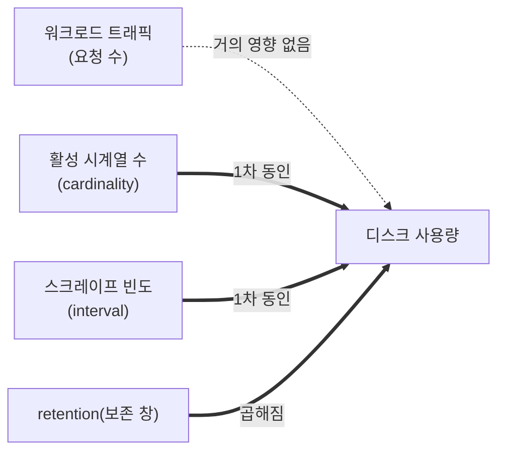

# Ch.12 심화 랩: Prometheus 용량과 Cardinality

> Ch.12 본문([README](./README.md))에서 Prometheus 아키텍처를 배웠습니다. 이 심화 랩에서는
> "**Prometheus는 디스크를 왜 이만큼 쓰는가?**"를 직접 측정하고, 용량을 줄이는 튜닝을 적용해
> 전/후를 비교합니다.

## 학습 목표

- Prometheus 디스크 용량 산정 공식을 이해한다
- 용량의 진짜 동인이 **트래픽이 아니라 cardinality(시계열 수) × 스크레이프 빈도**임을 이해한다
- retention의 의미("누적"이 아니라 "보존 창")를 이해한다
- PromQL로 cardinality 범인을 찾고, `metricRelabelings`로 용량을 줄여 전/후를 비교한다

---

## 1. 용량 산정 공식

Prometheus 공식 문서가 제시하는 디스크 용량 공식:

```
needed_disk_space = retention_time_seconds × ingested_samples_per_second × bytes_per_sample
```

| 항목 | 의미 |
|------|------|
| **sample(샘플)** | 시계열 1개를 1번 스크레이프한 데이터포인트 (타임스탬프 + 값) |
| **bytes_per_sample** | 공식 문서 기준 평균 **1~2 B** (압축 후 디스크). 실측 보통 ~1.6 B |
| **retention** | 이 기간이 지난 데이터는 **자동 삭제** |

> 💡 **메모리 ≠ 디스크**: 스크레이프 직후엔 샘플 1개가 16B(타임스탬프 8B + 값 8B)지만,
> 압축 후 디스크에는 ~1.6B로 저장됩니다. 위 공식의 `bytes_per_sample`은 디스크 기준입니다.

### 시계열 1개 직관

```
1 series @ 30초 = 86400/30 = 2,880 샘플/일 × 1.6B ≈ 4.6 KB/일
```

---

## 2. 가장 중요한 개념: 용량은 트래픽이 아니라 Cardinality가 결정한다



- 클러스터가 **놀고 있어도(idle)** 같은 시계열이 매 스크레이프마다 찍히므로 용량은 거의 안 줄어든다.
- 단, **새 레이블 조합**이 생기면 cardinality가 증가한다: 파드 잦은 생성/삭제(churn),
  새 namespace, 새 요청 경로 등. → "요청량"이 아니라 "**고유 레이블의 다양성·변화**"가 변수.

> ⚠️ **자주 하는 오해**: "50일 가동 = 50일치 누적". 틀립니다.
> retention=10d면 디스크는 가동 ~10일째에 평탄화되고 그 뒤로는 유지됩니다(누적 아님).

---

## 3. 실습 ①: 내 클러스터 측정하기 (수강생)

수강생은 **Grafana Explore**에서 PromQL을 실행합니다.

1. https://grafana.basphere.dev 접속 (수강생 계정)
2. 왼쪽 메뉴 **Explore** → 데이터소스 `Prometheus` 선택
3. 아래 쿼리를 하나씩 실행하고 값을 기록합니다.

```promql
# (1) 활성 시계열 수 — cardinality
prometheus_tsdb_head_series

# (2) 초당 수집 샘플 수
rate(prometheus_tsdb_head_samples_appended_total[10m])

# (3) 하루 예상 수집 용량(GB) — bytes/sample 1.7 가정
rate(prometheus_tsdb_head_samples_appended_total[1h]) * 86400 * 1.7 / 1e9
```

### ✍️ 워크시트

| 측정 | 내 클러스터 값 |
|------|----------------|
| (1) 활성 시계열 수 | __________ |
| (2) 초당 샘플 | __________ /s |
| (3) 하루 용량 | __________ GB/day |

**계산 문제**: retention이 10일이라면, 공식상 디스크 사용량은 약 몇 GB에서 평탄화될까요?
→ `(3) × 10 = ______ GB`

> 📌 참고 실측(basphere 클러스터, 2026-05): 시계열 ~174,000개, ~7,600 samples/s,
> ~1.1 GB/day → 10일 retention에서 ~10.5GB 평탄화 (20Gi 볼륨의 55%).

---

## 4. 실습 ②: Cardinality 범인 찾기 (수강생)

용량의 절반 이상이 어디서 나오는지 찾아봅니다. Grafana Explore에서:

```promql
# job(수집 대상)별 시계열 수 Top 10
topk(10, count by (job)({__name__=~".+"}))

# 메트릭 이름별 시계열 수 Top 15
topk(15, count by (__name__)({__name__=~".+"}))
```

### 관찰 포인트
- 어떤 `job`이 1등인가? (힌트: 대개 `apiserver`)
- 1등 메트릭들의 이름이 `..._bucket`으로 끝나지 않나? → **히스토그램**이 cardinality를 폭증시키는 주범

> 🔎 **왜 apiserver인가**: `apiserver_request_duration_seconds_bucket`는 40개 버킷으로 되어 있어
> `버킷 × verb × resource × code`로 곱해집니다. Kubernetes 업스트림도 이를 알려진 문제로 인정했고
> (Issue #105346), kube-prometheus-stack은 기본값에 일부 버킷 drop을 이미 넣어두고 있습니다.

---

## 5. 실습 ③: 튜닝 적용과 전/후 비교

> 🎓 **강사 데모** — `metricRelabelings`/스크레이프 주기 변경은 monitoring 네임스페이스 권한이
> 필요하므로 강사가 시연합니다. 수강생은 Grafana Explore에서 전/후 시계열 수 변화를 함께 관찰합니다.

### 5.1 적용 전 기준값 기록
```promql
prometheus_tsdb_head_series        # 예: 174,000
count by (job)({__name__=~".+"})   # apiserver 값 기록
```

### 5.2 apiserver 히스토그램 버킷 drop (효과 가장 큼)
`kube-prometheus-stack` values에서 apiserver ServiceMonitor에 relabeling 추가 후 `helm upgrade`:

```yaml
kubeApiServer:
  serviceMonitor:
    metricRelabelings:
      # 안 쓰는 큰 히스토그램 메트릭 통째로 제거
      - sourceLabels: [__name__]
        regex: apiserver_request_body_size_bytes_bucket|apiserver_response_sizes_bucket
        action: drop
```

```bash
helm upgrade kube-prometheus-stack prometheus-community/kube-prometheus-stack \
  -n monitoring -f prometheus-values.yaml
```

### 5.3 다른 레버 (선택)
```yaml
prometheus:
  prometheusSpec:
    scrapeInterval: 60s     # 30s→60s : 수집량 약 절반
    retention: 10d
    retentionSize: 16GB     # 20Gi의 ~80%, 디스크 상한 고정
```

### 5.4 적용 후 비교
몇 분 뒤 다시 측정:

| 측정 | 전 | 후 | 변화 |
|------|----|----|------|
| `prometheus_tsdb_head_series` | | | |
| apiserver job 시계열 | | | |
| 초당 샘플 `rate(...samples_appended_total[10m])` | | | |

> ⚠️ **주의**: 대시보드/알림 룰이 참조하는 버킷을 지우면 해당 패널이 "No Data"가 됩니다.
> 적용 후 API server 대시보드가 정상인지 반드시 확인하세요.

---

## 핵심 요약

| 개념 | 설명 |
|------|------|
| **용량 공식** | retention × 초당샘플 × bytes/sample(~1.6B) |
| **1차 동인** | 트래픽이 아니라 **cardinality(시계열 수) × 스크레이프 빈도** |
| **retention** | "누적"이 아니라 "보존 창" — 그 기간에서 평탄화됨 |
| **최대 범인** | apiserver `_bucket` 히스토그램 (전체의 절반 이상) |
| **튜닝 순서** | ① 히스토그램 drop → ② 스크레이프 주기 ↑ → ③ retention/size 상한 |

> **운영 참고 문서**: 동일 주제의 실측·출처 정리본은 인프라 저장소
> `kubernetes-onprem-infra/docs/prometheus-capacity-and-cardinality.md`에 있습니다.

---

> **이전**: [Ch.12 모니터링과 관측성](./README.md) · **다음 챕터**: [Ch.13 종합 데모](../ch13-comprehensive-demo/README.md)
