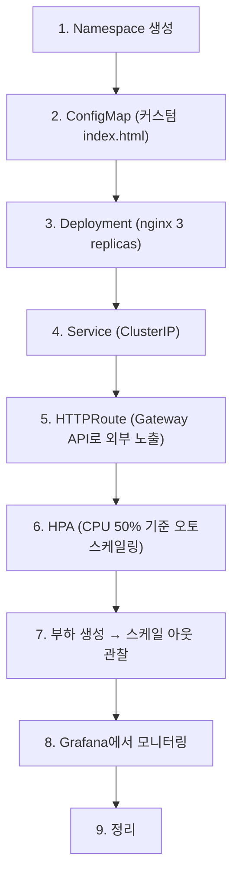
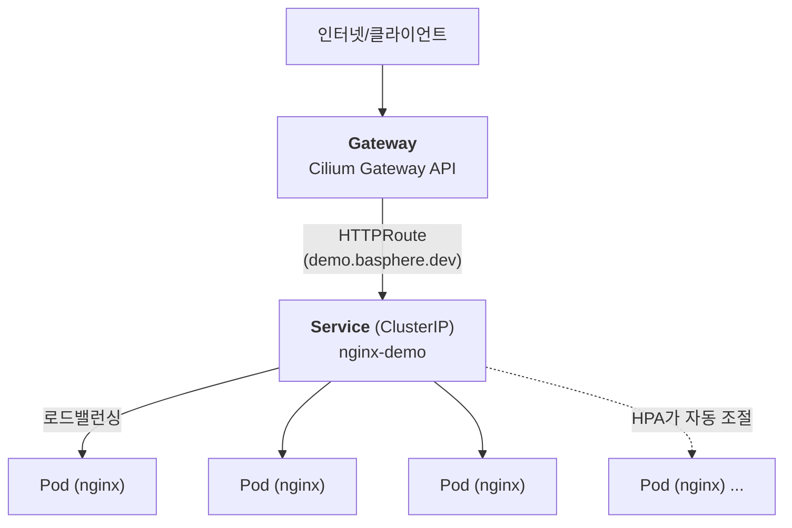

# Ch.13 종합 데모: 배포부터 오토스케일링까지

> 🎓 **강사 데모** — 이 섹션은 강사가 시연합니다. 수강생들은 Headlamp이나 Grafana에서 결과를 확인할 수 있습니다.

## 학습 목표

- 지금까지 배운 내용을 종합하여 실제 서비스 배포 시나리오를 경험한다
- Namespace → ConfigMap → Deployment → Service → HTTPRoute → HPA 전체 흐름을 이해한다
- Grafana에서 오토스케일링 동작을 관찰한다

---

## 시나리오 개요

이번 데모에서는 다음과 같은 **엔드투엔드 시나리오**를 진행합니다:



---

## 단계별 실습

### 1단계: Namespace 생성

```bash
kubectl apply -f examples/demo-namespace.yaml
```

**예상 출력:**
```
namespace/demo created
```

**확인:**
```bash
kubectl get namespace demo
```

**예상 출력:**
```
NAME   STATUS   AGE
demo   Active   3s
```

---

### 2단계: ConfigMap 생성 (커스텀 index.html)

nginx에서 제공할 커스텀 HTML 페이지를 ConfigMap으로 정의합니다.

```bash
kubectl apply -f examples/demo-configmap.yaml
```

**예상 출력:**
```
configmap/nginx-html created
```

**확인:**
```bash
kubectl describe configmap nginx-html -n demo
```

---

### 3단계: Deployment 생성 (nginx 3 replicas)

```bash
kubectl apply -f examples/demo-deployment.yaml
```

**예상 출력:**
```
deployment.apps/nginx-demo created
```

**Pod 상태 확인:**
```bash
kubectl get pods -n demo -l app=nginx-demo
```

**예상 출력:**
```
NAME                          READY   STATUS    RESTARTS   AGE
nginx-demo-xxxxxxxxxx-xxxxx   1/1     Running   0          10s
nginx-demo-xxxxxxxxxx-yyyyy   1/1     Running   0          10s
nginx-demo-xxxxxxxxxx-zzzzz   1/1     Running   0          10s
```

> 3개의 Pod가 모두 `Running` 상태인지 확인합니다.

---

### 4단계: Service 생성 (ClusterIP)

```bash
kubectl apply -f examples/demo-service.yaml
```

**예상 출력:**
```
service/nginx-demo-svc created
```

**확인:**
```bash
kubectl get svc -n demo
```

**예상 출력:**
```
NAME             TYPE        CLUSTER-IP      EXTERNAL-IP   PORT(S)   AGE
nginx-demo-svc   ClusterIP   10.96.xxx.xxx   <none>        80/TCP    5s
```

---

### 5단계: HTTPRoute 생성 (Gateway API로 외부 노출)

Gateway API의 HTTPRoute를 사용하여 외부에서 접근 가능하도록 설정합니다.

```bash
kubectl apply -f examples/demo-httproute.yaml
```

**예상 출력:**
```
httproute.gateway.networking.k8s.io/nginx-demo-route created
```

**확인:**
```bash
kubectl get httproute -n demo
```

**예상 출력:**
```
NAME               HOSTNAMES              AGE
nginx-demo-route   ["demo.basphere.dev"]  5s
```

**접속 테스트:**
```bash
curl -s https://demo.basphere.dev
```

또는 웹 브라우저에서 `https://demo.basphere.dev` 접속

**예상 출력 (웹 브라우저에서 확인 시):**

> **Basphere Kubernetes Training**
>
> `Kubernetes v1.35.3`
>
> 이 페이지는 쿠버네티스 클러스터에서 실행 중인 nginx Pod에서 제공됩니다.
>
> **구성 요소:**
> - ConfigMap으로 HTML 콘텐츠 관리
> - Deployment로 복제본 관리
> - Service로 로드밸런싱
> - Gateway API HTTPRoute로 외부 노출
> - HPA로 자동 스케일링

curl로 확인 시에는 HTML 소스가 출력됩니다. `<h1>Basphere Kubernetes Training</h1>` 텍스트가 포함되어 있으면 정상입니다.

---

### 6단계: HPA 적용 (CPU 50% 목표)

```bash
kubectl apply -f examples/demo-hpa.yaml
```

**예상 출력:**
```
horizontalpodautoscaler.autoscaling/nginx-demo-hpa created
```

**확인:**
```bash
kubectl get hpa -n demo
```

**예상 출력:**
```
NAME             REFERENCE               TARGETS   MINPODS   MAXPODS   REPLICAS   AGE
nginx-demo-hpa   Deployment/nginx-demo   0%/50%    2         10        3          10s
```

> TARGETS의 왼쪽 값이 현재 CPU 사용률, 오른쪽이 목표값입니다.

---

### 7단계: 부하 생성 및 오토스케일링 관찰

**터미널 1: HPA 실시간 모니터링**
```bash
kubectl get hpa -n demo -w
```

**터미널 2: Pod 실시간 모니터링**
```bash
kubectl get pods -n demo -l app=nginx-demo -w
```

**터미널 3: 부하 생성**

간단한 부하를 생성하기 위해 클러스터 내에서 반복 요청을 보냅니다. 여러 동시 요청을 보내야 CPU 부하가 발생합니다:

```bash
# 부하 생성 Pod 실행 (여러 프로세스로 동시 요청)
kubectl run -n demo load-generator --image=busybox:1.37 --restart=Never -- \
  /bin/sh -c "while true; do wget -q -O- http://nginx-demo-svc.demo.svc.cluster.local > /dev/null 2>&1; done"
```

> **팁**: 부하가 충분하지 않으면 동일한 명령으로 load-generator-2, load-generator-3 등 추가 Pod를 생성하여 부하를 높일 수 있습니다.
> 또는 부하 테스트 도구(loadtest.basphere.dev)를 활용할 수 있습니다.

**터미널 1 관찰 (HPA):**
```
NAME             REFERENCE               TARGETS   MINPODS   MAXPODS   REPLICAS   AGE
nginx-demo-hpa   Deployment/nginx-demo   0%/50%    2         10        3          1m
nginx-demo-hpa   Deployment/nginx-demo   65%/50%   2         10        3          2m
nginx-demo-hpa   Deployment/nginx-demo   65%/50%   2         10        5          2m
nginx-demo-hpa   Deployment/nginx-demo   42%/50%   2         10        5          3m
```

**터미널 2 관찰 (Pod):**
- 새로운 Pod가 생성되는 것을 확인할 수 있습니다
- Pod 수가 3개에서 증가합니다

---

### 8단계: Grafana에서 모니터링

1. **https://grafana.basphere.dev** 접속 (student / k8s-training)
2. **Kubernetes / Compute Resources / Namespace (Pods)** 대시보드
3. Namespace: `demo` 선택
4. 관찰 포인트:
   - CPU 사용량 변화 그래프
   - Pod 수 변화
   - 네트워크 트래픽 증가

---

### 9단계: 정리

모든 데모가 끝나면 리소스를 정리합니다.

```bash
# 네임스페이스 삭제 (모든 리소스 함께 삭제 — load-generator Pod 포함)
kubectl delete namespace demo
```

**예상 출력:**
```
namespace "demo" deleted
```

> **참고**: 네임스페이스 삭제 시 해당 네임스페이스의 모든 리소스(Deployment, Service, HPA, HTTPRoute, Pod 등)가 함께 삭제됩니다. 삭제에 수십 초 정도 소요될 수 있습니다.

**확인:**
```bash
kubectl get all -n demo
```

**예상 출력:**
```
No resources found in demo namespace.
```

---

## 전체 아키텍처 요약



> 모든 Pod는 ConfigMap으로 커스텀 HTML을 제공합니다.

---

## 핵심 요약

| 개념 | 설명 |
|------|------|
| **Namespace** | 리소스 격리 단위. 팀/환경별 분리에 활용 |
| **ConfigMap** | 설정 데이터(HTML 파일 등)를 볼륨 마운트로 Pod에 주입 |
| **Deployment** | 무상태 앱 배포 및 Rolling Update 관리 |
| **Service (ClusterIP)** | Pod 그룹에 대한 안정적인 내부 엔드포인트 |
| **HTTPRoute** | Gateway API를 통한 외부 HTTP 라우팅 (호스트 기반) |
| **HPA** | CPU/메모리 메트릭 기반 Pod 수 자동 조절 |
| **Grafana** | Prometheus 메트릭을 시각화하여 실시간 모니터링 |

1. 실제 서비스 배포는 **Namespace → ConfigMap/Secret → Deployment → Service → HTTPRoute** 순서로 진행합니다
2. **HPA**를 설정하면 부하에 따라 Pod 수가 자동으로 조절됩니다
3. **Grafana**에서 CPU 사용량, Pod 수 변화, 네트워크 트래픽을 실시간으로 확인할 수 있습니다
4. 이 흐름은 실무에서 마이크로서비스를 배포하는 **기본 패턴**입니다

---

> **다음 챕터**: [Ch.14 실무 적용 가이드](../ch14-real-world/README.md)
