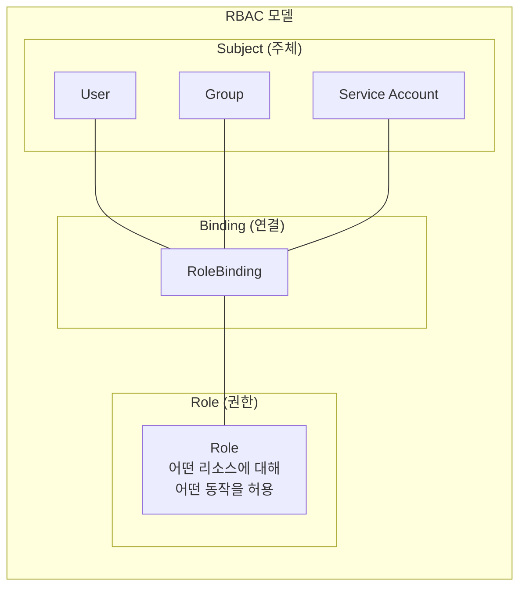
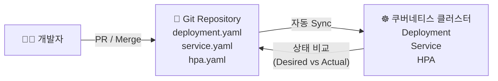

# Ch.14 실무 적용 가이드

## 학습 목표

- 쿠버네티스 실무에서 자주 사용하는 도구와 패턴을 알아본다
- Helm, RBAC, GitOps 등의 개념을 이해한다
- 향후 학습 방향과 자격증 정보를 안내한다

---

## 1. Helm: 패키지 매니저

### Helm이란?

Helm은 쿠버네티스의 **패키지 매니저**입니다. apt(Ubuntu), yum(CentOS), brew(macOS)와 비슷한 역할을 합니다.

### 핵심 개념

| 용어 | 설명 | 비유 |
|------|------|------|
| **Chart** | 쿠버네티스 리소스의 템플릿 패키지 | `.deb` 또는 `.rpm` 패키지 |
| **Repository** | Chart를 저장하는 저장소 | apt repository |
| **Release** | Chart를 클러스터에 설치한 인스턴스 | 설치된 프로그램 |
| **Values** | Chart의 설정값을 커스터마이징 | 설정 파일 |

### Helm 사용 예시

```bash
# 리포지토리 추가
helm repo add bitnami https://charts.bitnami.com/bitnami
helm repo update

# Chart 검색
helm search repo nginx

# Chart 설치
helm install my-nginx bitnami/nginx --namespace web --create-namespace

# 설치된 Release 확인
helm list -A

# Values 커스터마이징
helm install my-nginx bitnami/nginx \
  --set replicaCount=3 \
  --set service.type=ClusterIP

# Release 업그레이드
helm upgrade my-nginx bitnami/nginx --set replicaCount=5

# Release 삭제
helm uninstall my-nginx -n web
```

### 실제 활용 사례

우리 클러스터에서도 Helm으로 설치된 컴포넌트들이 있습니다:
- **kube-prometheus-stack**: Prometheus + Grafana 모니터링 스택
- **Cilium**: CNI 플러그인
- **vSphere CSI Driver**: 스토리지 드라이버

---

## 2. Namespace 전략

### 네임스페이스를 나누는 기준

| 전략 | 구조 | 적합한 환경 |
|------|------|-------------|
| **팀별** | `team-frontend`, `team-backend`, `team-data` | 여러 팀이 하나의 클러스터를 공유 |
| **환경별** | `dev`, `staging`, `production` | 단일 클러스터에서 여러 환경 운영 |
| **프로젝트별** | `project-a`, `project-b` | 프로젝트 단위 격리 |
| **혼합** | `team-backend-dev`, `team-backend-prod` | 대규모 조직 |

### 네임스페이스 모범 사례

- 기본 네임스페이스(`default`)에 리소스를 배포하지 않습니다
- ResourceQuota로 네임스페이스별 리소스 사용량을 제한합니다
- LimitRange로 Pod/Container의 기본 리소스 요청/제한을 설정합니다
- NetworkPolicy로 네임스페이스 간 통신을 제어합니다

```yaml
# ResourceQuota 예시
apiVersion: v1
kind: ResourceQuota
metadata:
  name: team-quota
  namespace: team-backend
spec:
  hard:
    requests.cpu: "10"
    requests.memory: 20Gi
    limits.cpu: "20"
    limits.memory: 40Gi
    pods: "50"
```

---

## 3. RBAC (Role-Based Access Control)

### RBAC 개요

RBAC는 **누가(Subject) 무엇을(Resource) 어떻게(Verb) 할 수 있는지**를 정의하는 접근 제어 방식입니다.

### RBAC 리소스



| 리소스 | 범위 | 설명 |
|--------|------|------|
| **Role** | 네임스페이스 | 특정 네임스페이스 내 권한 정의 |
| **ClusterRole** | 클러스터 전체 | 클러스터 전체 범위 권한 정의 |
| **RoleBinding** | 네임스페이스 | Role/ClusterRole과 Subject를 연결 |
| **ClusterRoleBinding** | 클러스터 전체 | ClusterRole과 Subject를 연결 |

### RBAC 예시: 읽기 전용 사용자

```yaml
# Role: pods와 services를 읽기만 가능
apiVersion: rbac.authorization.k8s.io/v1
kind: Role
metadata:
  name: pod-viewer
  namespace: team-backend
rules:
  - apiGroups: [""]
    resources: ["pods", "services", "configmaps"]
    verbs: ["get", "list", "watch"]

---
# RoleBinding: student 사용자에게 pod-viewer Role 부여
apiVersion: rbac.authorization.k8s.io/v1
kind: RoleBinding
metadata:
  name: student-pod-viewer
  namespace: team-backend
subjects:
  - kind: User
    name: student
    apiGroup: rbac.authorization.k8s.io
roleRef:
  kind: Role
  name: pod-viewer
  apiGroup: rbac.authorization.k8s.io
```

> **참고**: 이번 교육에서 수강생들이 사용하는 kubeconfig의 ServiceAccount에는 `view` ClusterRole이 바인딩되어 있어 모든 네임스페이스의 리소스를 **읽기만** 할 수 있습니다.

---

## 4. GitOps

### GitOps란?

GitOps는 **Git 리포지토리를 "단일 진실의 원천(Single Source of Truth)"으로 사용**하여 쿠버네티스 클러스터의 상태를 관리하는 운영 방식입니다.



### 주요 GitOps 도구

| 도구 | 특징 |
|------|------|
| **ArgoCD** | 웹 UI 제공, 직관적인 시각화, 가장 인기 있는 GitOps 도구 |
| **FluxCD** | 경량, CLI 중심, CNCF 졸업 프로젝트 |

### GitOps 워크플로우

1. 개발자가 YAML 매니페스트를 **Git에 Push**
2. ArgoCD/FluxCD가 Git 리포지토리를 **감시**
3. 변경 감지 시 클러스터에 **자동 배포**
4. 클러스터 상태와 Git 상태를 **지속적으로 비교**
5. 차이가 발견되면 **자동 복구(Self-Healing)** 또는 알림

### GitOps의 장점

- **감사 추적(Audit Trail)**: 모든 변경이 Git 커밋으로 기록됨
- **롤백 용이**: `git revert`로 이전 상태로 복구 가능
- **코드 리뷰**: PR/MR 프로세스를 통한 변경 검증
- **자동화**: 수동 `kubectl apply` 불필요

---

## 5. CKA/CKAD 자격증 안내

### 자격증 종류

| 자격증 | 이름 | 대상 | 시험 시간 | 합격 점수 |
|--------|------|------|-----------|-----------|
| **CKA** | Certified Kubernetes Administrator | 클러스터 관리자 | 2시간 | 66% |
| **CKAD** | Certified Kubernetes Application Developer | 애플리케이션 개발자 | 2시간 | 66% |
| **CKS** | Certified Kubernetes Security Specialist | 보안 전문가 | 2시간 | 67% |

### 시험 특징

- **실기 시험**: 실제 쿠버네티스 클러스터에서 문제를 풀어야 합니다 (객관식 아님)
- **오픈 북**: 시험 중 공식 쿠버네티스 문서(kubernetes.io/docs) 참조 가능
- **온라인 감독관**: 자택에서 온라인으로 응시 가능

### 추천 학습 순서

```
CKAD (애플리케이션 개발자) → CKA (클러스터 관리자) → CKS (보안 전문가)
```

### CKA 시험 범위

| 도메인 | 비중 |
|--------|------|
| 클러스터 아키텍처, 설치, 구성 | 25% |
| 워크로드 및 스케줄링 | 15% |
| 서비스 및 네트워킹 | 20% |
| 스토리지 | 10% |
| 트러블슈팅 | 30% |

---

## 6. 추천 학습 리소스

### 공식 문서

| 리소스 | URL |
|--------|-----|
| 쿠버네티스 공식 문서 | https://kubernetes.io/docs/ |
| 쿠버네티스 공식 문서 (한국어) | https://kubernetes.io/ko/docs/ |
| Cilium 공식 문서 | https://docs.cilium.io/ |
| Helm 공식 문서 | https://helm.sh/docs/ |

### 온라인 학습

| 리소스 | 설명 |
|--------|------|
| **Kubernetes The Hard Way** | Kelsey Hightower의 수동 클러스터 구축 가이드 (원리 이해에 최적) |
| **KillerCoda** | 브라우저 기반 무료 쿠버네티스 실습 환경 |
| **Udemy - CKA/CKAD 강의** | Mumshad Mannambeth 강사의 인기 강좌 |

### 커뮤니티

| 커뮤니티 | 설명 |
|----------|------|
| **CNCF Slack** | 쿠버네티스 공식 Slack 채널 (#kubernetes-users) |
| **한국 쿠버네티스 사용자 그룹** | Facebook/Meetup에서 활동 |
| **CNCG (Cloud Native Community Groups)** | 지역별 클라우드 네이티브 밋업 |

### 추천 도서

| 도서 | 저자 | 설명 |
|------|------|------|
| Kubernetes in Action (2nd ed.) | Marko Luksa | 쿠버네티스 심층 이해 |
| 쿠버네티스 완벽 가이드 | 마사야 아오야마 | 한국어 번역본 제공 |

---

## 2일간의 교육을 마치며

이번 교육에서 다룬 내용을 정리합니다:

### Day 1 핵심 내용
- 컨테이너와 쿠버네티스 기본 개념
- Pod, ReplicaSet, Deployment
- ConfigMap, Secret, 리소스 관리, Probe
- kubeadm 클러스터 구축
- Service와 네트워킹
- Cilium CNI와 BGP LoadBalancer
- Gateway API HTTP 라우팅

### Day 2 핵심 내용
- 스토리지: emptyDir, hostPath, PV, PVC
- StorageClass와 동적 프로비저닝 (vSphere CSI)
- StatefulSet과 데이터베이스 운영
- HPA 오토스케일링
- Prometheus & Grafana 모니터링
- 종합 데모
- 실무 적용 가이드

### 다음 단계 제안

1. **kubectl 연습**: 다양한 명령어에 익숙해지세요
2. **개인 환경 구축**: minikube, kind, k3s 등으로 로컬 클러스터를 만들어 실습하세요
3. **Helm 활용**: 오픈소스 Chart를 설치하고 커스터마이징해 보세요
4. **GitOps 도입**: ArgoCD를 설치하고 Git 기반 배포를 경험해 보세요
5. **자격증 도전**: CKAD 또는 CKA 시험에 도전해 보세요

---

> 교육에 참여해 주셔서 감사합니다!
